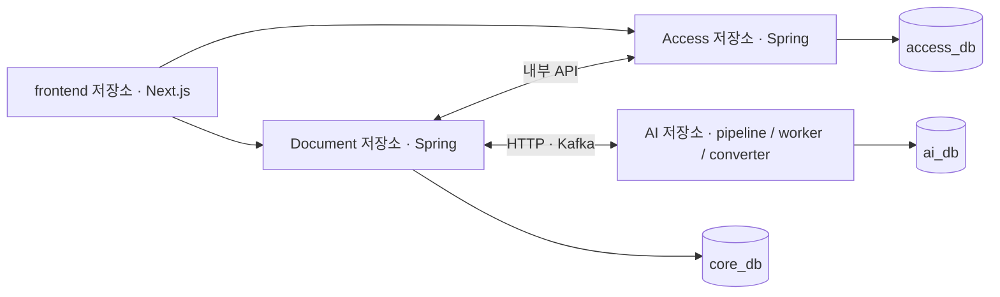
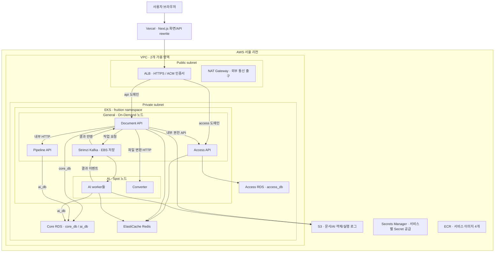
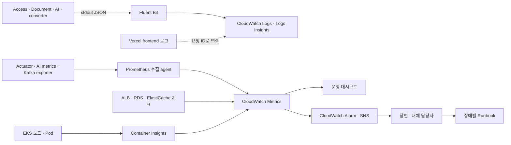

# 아키텍처

기준일 2026-08-14. 상세 이력·검증 원문: `docs/backlog/msa/`, `docs/backlog/Fruition_AWS_MSA_Architecture.md`

## 1. 서비스 경계 (전부 독립 배포 단위)

```text
frontend (Next.js, Vercel)
  │ /api/* 경로 기반 rewrite (next.config.mjs)
  ├─ /api/auth/*, 워크스페이스 자체 CRUD·휴지통·복구 ─▶ access-svc
  └─ 그 외 ───────────────────────────────────────────▶ document-svc

frontend/          Next.js (Vercel 배포), 독립 npm 프로젝트
Access/            Spring :8081, 독립 Gradle — 로그인·OAuth·세션·워크스페이스·권한
Document/          Spring :8080, 독립 Gradle — 문서·채팅·Wiki·Skill gateway·query
AI/
├─ pipeline/       FastAPI API + 동일 이미지 기반 Kafka worker, ai_db 소유
└─ converter/      PDF→Markdown 변환, pipeline 복원 코드 공유
platform/
├─ infra/          Terraform·공용 로컬 의존 서비스
├─ k8s/            클러스터·서비스 배포 명세
├─ scripts/        통합 실행·배포·검증
└─ docs/           전체 구조·공통 계약·운영 절차

상태 계층: PostgreSQL(access_db·core_db·ai_db 분리) · Redis · Kafka · MinIO/S3
```

코드 경계는 컴파일러가 강제한다: `document-svc`(fruition.core)는 `fruition.access`를 import하지 않고, `access-svc`는 `fruition.core`를 import하지 않는다. 두 앱은 서로의 DB repository를 직접 쓰지 않고 내부 API·Redis projection으로만 연결한다. (실측: 교차 import 양방향 0건)

### GitHub 저장소 분리 경계

`frontend/`, `Access/`, `Document/`, `AI/` 각각을 새 저장소의 루트로 옮길 수 있다. 각 폴더에는 자체 의존성 정의·테스트·`.github/workflows/ci.yml`이 들어 있다. Java 서비스는 Gradle wrapper와 Dockerfile, `api-specs/openapi.yaml`을 각각 소유한다. AI 계약은 `AI/pipeline/api-specs/openapi.yaml`이다.

상위 Gradle 멀티 프로젝트와 `java-shared` 컴파일 의존성을 제거했다. 기존 공통 소스·테스트는 Access와 Document 내부에 편입했으며, `fruition.shared` 패키지 이름은 유지한다. 앞으로 두 저장소의 JWT·오류 응답·멱등성 계약 변경은 각각 검증해야 한다. 공통 라이브러리 배포 서버 없이 독립 빌드하기 위한 선택이다.

AI는 pipeline·worker 이미지 하나와 converter 이미지 하나를 빌드한다. converter가 pipeline의 문서 복원 코드와 Rust 도구를 사용하므로 두 디렉터리는 같은 AI 저장소에 둔다. DB·Redis·Kafka 같은 런타임 의존성은 소스 분리와 별개이며 기존 HTTP/Kafka 계약과 DB 소유권을 유지한다.



platform은 다섯 번째 독립 저장소 경계다. 각 서비스는 코드·빌드·API·migration을 소유하고 platform은 Terraform·Kubernetes·관측·통합 실행을 소유한다. platform 배포 workflow는 소스를 빌드하지 않고 ECR에 존재하는 release 태그를 명시적으로 받아 이미지 존재를 확인한다. 현재 배포기는 네 이미지에 같은 태그를 요구한다. 서비스별 SHA를 담는 release manifest·이미지 게시 CI·실제 저장소 OIDC 연결은 후속 작업이며 원격 게시·배포는 실행하지 않았다.

## 2. 서비스 간 통신

- Query 요청은 질의별 `allow_web_search`를 필수로 전달한다. `document-svc`는 사용자 전역 설정을 조회하지 않고 요청값을 메시지와 run에 snapshot으로 남긴 뒤 Query HTTP/Kafka payload에 전달한다.

| 방향 | 방식 | 용도 |
|---|---|---|
| document → access | `GET /internal/authz/workspaces/{wid}/users/{uid}`, `GET /internal/users/{uid}`, `GET·PUT /internal/workspaces/{wid}/ai-model-settings` (X-Internal-Token) | 권한·표시명·workspace AI 모델 설정 조회/변경 |
| access → document | `POST /internal/workspaces/{wid}/initial-note` (X-Internal-Token, best-effort, 커밋 후 호출) | 새 워크스페이스 초기 노트 |
| document → ai-svc | Kafka `ai.ingest.command`(key=document_id), `ai.query.command`, `ai.agent.command`, `ai.maintenance.command` | 비동기 ingest·Query·Agent·Lint·Restore |
| document → ai-svc | HTTP + X-Internal-Token | 동기 Query, Wiki 현재 상태 조회, pipeline run 폴링, Agent Tool run·승인 인자 인가 |
| document → ai-svc | HTTP + X-Agent-Service-Token | JWT Skill 관리 요청 중계 |
| document → ai-svc | `GET /agent/runs/{run_id}` + X-Agent-Service-Token | Skill draft source를 workspace/user scope로 canonical 조회 |
| document → converter | HTTP (내부 전용, 큐 worker 경유) | PDF→Markdown 변환 (read timeout 900s) |
| ai-svc → document | Kafka `ai.task.event` | Query 단계 진행 이벤트와 AI 작업 최종 결과 전달 |
| ai-svc → document | 내부 HTTP + X-Internal-Token | ingest 원본 metadata·core 기여 이력 조회 |
| ai-svc → document | `POST /internal/agent/tools/{read|execute}/{tool}` + X-Agent-Service-Token | P0 문서·폴더 조회와 승인된 변경 실행. document-svc가 core_db 소유 경계에서 실제 처리 |
| ai-svc → document | `POST /internal/agent/skill-authoring/references/read` + X-Agent-Service-Token | Skill 참조 scope·role 검증, EDITABLE 최신 PostgreSQL Markdown 조회; ORIGINAL은 ai-svc가 ai_db source block 조립 |
| ai-svc → access | `GET /internal/authz/workspaces/{wid}/users/{uid}` + X-Internal-Token | Skill 팀 범위 멤버·owner 확인 |
| 사용자 인증 | 각 앱이 JWT(iss·aud, HS256 공유 시크릿) 로컬 검증 | access 호출 없이 검증 |

Java 서비스는 요청 단위 로그를 `X-Request-ID`로 잇는다. 요청에 유효한 값이 오면 그대로 쓰고 없으면 새로 만들며, 응답 헤더로 되돌려준다. 이 값은 MDC `requestId`, JWT 주체는 `userId`, Kafka 발행·소비 경계의 `run_id`는 `flowId`로 남아 모든 로그 줄에 함께 출력된다. `flowId`는 Kafka 메시지 헤더로 전파하지 않으므로 ai-svc worker 로그와는 `run_id` 값으로 대조한다.

OAuth 로그인은 provider 왕복 동안에만 `IF_REQUIRED` 세션을 사용한다. 성공 시 access-svc는 Redis에 1회용 교환 코드를 저장하고 프론트 `/oauth/callback`으로 전달한다. 성공·실패 handler는 응답을 redirect하기 전에 handshake 세션을 즉시 폐기하며, 이후 인증은 프론트가 교환한 JWT만 사용한다. 인증 컨텍스트는 세션에 저장하지 않는다(`RequestAttributeSecurityContextRepository`) — 세션은 OAuth handshake의 `AUTHORIZATION_REQUEST` 보관에만 쓰이며, 병렬 요청이 `SPRING_SECURITY_CONTEXT`를 동시에 INSERT해 발생하던 500을 차단한다.

## 3. LLM 설정 전달

지원 조합은 `openai/gpt-5-nano`(`reasoning_effort=medium`), `gemini/gemini-3.1-flash-lite`(`low`), `claude/claude-sonnet-5`(extended thinking 없음)뿐이다. 요청에서 provider/model을 함께 생략하는 공통 기본값은 `openai/gpt-5-nano`이고, 새 workspace의 Ingest·Lint 및 PDF 복원 기본값은 `gemini/gemini-3.1-flash-lite`다. Ingest·Lint command, PDF 변환과 Skill author/publish/update는 workspace 설정을 snapshot하고, Query·Markdown Agent·Agent 경로는 chat/request 설정을 snapshot한다. provider/model은 사용자 설정·API·DB·Kafka payload에서 오며 env override는 없다.

ai-svc와 converter는 선택 provider의 `OPENAI_API_KEY`·`GEMINI_API_KEY`·`ANTHROPIC_API_KEY`만 secret env에서 읽고 base URL은 provider별로 고정한다. API key는 backend·Kafka payload/event·log에 넣지 않는다. live provider 호출은 선택 provider key가 필요하고 mock 통합 테스트는 key 없이 실행한다.

## 4. 권한 인가

document-svc는 workspace 멤버십을 DB에서 직접 읽지 않는다:

```text
요청 → document-svc guard.requireMember(wid, uid)
  1. Redis authz:role:{wid}:{uid} 조회 (TTL 300s) → hit(OWNER/MEMBER/NONE) 즉시 판정
  2. miss → access-svc GET /internal/authz/... (connect 2s/read 3s) → TTL 300s 캐시 후 판정
  3. HTTP 실패 → WorkspaceNotFoundException (fail-closed, 404)
```

projection 적재는 document-svc가 miss 시 내부 API 판정 결과를 캐시하는 방식이고, access-svc는 멤버십이 변하는 지점(워크스페이스 삭제·복구, 멤버 역할 변경·제거, 초대 수락)에서 무효화만 담당한다. **access-svc가 죽어도 캐시 warm 상태의 문서 기능은 계속 동작한다**(TTL 내). 실측: access 강제 정지 중 문서 조회 200·업로드 201, cold 캐시는 fail-closed 404. 결정 근거: [adr/0002](adr/0002-choose-auth-strategy.md)

## 5. 데이터 소유

저장소·테이블 상세는 [data-model.md](data-model.md). 요약:

- access-svc → **access_db** (users·oauth·refresh token·workspaces·members·세션·workspace AI 모델 설정) + Redis projection
- document-svc → **core_db** (문서 metadata·폴더·채팅·operation·Wiki revision/기여 이력·질의 모델 snapshot·본문·편집 revision·write receipt·content version·asset/reference·Agent 적용 감사·`document_edit_outbox`) + Redis (query run·SSE) + S3/MinIO (원본·snapshot). 문서 편집 관련 PostgreSQL 변경은 하나의 transaction으로 일관성을 보장하며, fresh cutover에서 import·fallback·dual-write를 사용하지 않는다. V39 당시 기존 `document_edit` 감사 행은 `document_restore_blocked`로 복구를 차단하고 Wiki ingest/lint와 새 작업은 보존한다. 결정 근거: [adr/0016](https://github.com/FruitionKR/Fruition-document/blob/main/docs/adr/0016-consolidate-document-body-into-postgres.md). Skill은 저장하지 않고 JWT 인가와 참조 문서 read 경계만 담당한다.
- ai-svc → **ai_db** (Wiki 현재 상태·source block·embedding·pipeline run·schema·파생물 stale 추적·Agent·Skill·LangGraph checkpoint).
- DB 계정 runtime(DML)/migration(DDL) 분리. `ai_runtime`은 core DB DML 권한과 연결 설정을 갖지 않는다. Markdown Agent 요청 시 document-svc는 core의 좁은 적용 예약 projection과 outbox만 원자 저장하고, AI run 상태는 scope가 포함된 내부 API로 조회한다. 결정 근거: [adr/0001](adr/0001-choose-primary-database.md), [adr/0005](adr/0005-prepare-wiki-database-boundary.md)

## 6. 이벤트 처리

AI command publisher는 `ai_command_outbox`를 `created_at, id` 순서로 최대 100건 `FOR UPDATE SKIP LOCKED` 조회하고, Kafka ACK와 행 삭제 커밋까지 같은 트랜잭션에서 잠근다. rolling update 중 다른 publisher는 잠긴 행을 건너뛴다. ACK 후 DB 커밋 전에 실패하면 재전달되므로 소비자 멱등성은 계속 필요하다. PostgreSQL 통합 테스트는 동시 publisher·broker 실패 재시도·ACK 후 DB 롤백을 검증한다. 이 변경은 별도 `document_edit_outbox` publisher나 전체 서비스의 다중 replica 안전성을 보장하지 않는다.

본문 저장은 PostgreSQL transaction에서 본문·편집 revision·write receipt·content version·asset/reference·Agent 적용 감사와 `document_edit_outbox`를 함께 기록한 뒤 outbox publisher가 Kafka `document.edit.event`(key=document_id)를 발행한다. event JSON은 `event_id`, `event_type`, `schema_version`, `document_id`, `workspace_id`, `revision`, `content_hash`, `created_at` 필드를 유지한다. publisher는 `created_at, event_id` 순으로 최대 100건을 처리하고 첫 실패에서 해당 cycle을 중단한다. Kafka 전송 후 표시 전에 장애가 나면 중복될 수 있어 at-least-once이며, consumer는 더 큰 revision만 반영해 중복·역순 event를 흡수한다. 현재 document-svc와 edit-event-consumer는 각각 1 replica 전제다. 결정 근거: [adr/0016](https://github.com/FruitionKR/Fruition-document/blob/main/docs/adr/0016-consolidate-document-body-into-postgres.md). AI 작업은 Spring이 `run_id`와 필요 시 `operation_id`를 먼저 만들고 domain 상태와 `ai_command_outbox`를 같은 core DB 트랜잭션에 저장한 뒤 발행한다. Query·ingest·lint command에는 적용할 `provider`와 `model` snapshot도 포함한다. Query worker는 pipeline의 단계 이벤트를 `status=progress`인 Kafka `ai.task.event`로 즉시 발행하고, document-svc는 Redis에서 `event_id`를 선점해 중복을 제거한 뒤 `query.log` SSE로 중계한다. 단계 이벤트와 최종 결과는 같은 `run_id` Kafka key를 사용해 순서를 유지한다. 단계 이벤트는 화면 피드백 용도라 양쪽 모두 유실을 허용한다. worker는 발행이 실패해도 질의를 계속하고, document-svc는 중계 실패를 로그만 남긴다 — 여기서 예외를 올리면 무한 재시도가 같은 파티션의 최종 결과까지 막기 때문이다. Agent 결과는 `markdown_edit`·`markdown_create`의 canonical Markdown을 검증하고, `chat_answer`·`clarify`·`reject`는 Markdown이 없는 정상 비수정 결과로 반영한다. `folder_organize`·`workspace_workflow` 자율 action도 허용하며 그 밖의 action은 거절한다. AI worker는 최종 결과도 전달받은 `run_id`로 `ai.task.event`에 보낸다. `log_callback_url`은 Wiki 생성 `pipeline.log` 진행 로그 전송에만 사용하며 Query와 HTTP result callback에는 사용하지 않는다. document-svc는 `ai_task_result_receipts`로 최종 결과를 멱등 반영하며 ingest는 AI run 폴링으로 event 유실도 복구한다. 기존 AI 작업 로그 조회/결과 경로는 LLM 설정을 받지 않는다.

document-svc는 ingest 결과를 반영하기 전에 Markdown과 기여 object key가 등록된 workspace·page·operation prefix와 일치하는지 검증한다. 다른 작업의 key를 현재 기여로 연결하는 callback은 계약 오류로 거부한다.

ingest Kafka key는 `document_id`라 같은 문서의 순서는 유지하면서 같은 workspace의 서로 다른 문서 LLM·분석을 병렬 처리한다. ingest worker는 Wiki 저장 후 `post_ingest` maintenance command 발행까지 성공해야 원본 offset을 commit한다. 후속 run은 결정적 UUID와 `pipeline_runs.manifest` checkpoint로 중복을 흡수하고 Meaning Cluster 판단→source-grounded Source+Concept retrieval 평가를 순차 실행한다. Query가 semantic 검색 모드이면 변경 page와 Source block·Concept evidence unit을 같은 BGE-M3 모델로 임베딩하고, keyword·unit vector 후보를 함께 검색한 뒤 graph를 탐색한다. evidence selector는 source ref 중복을 제거한 전역 상위 근거만 반환하며 일반 Query는 최대 8개, 단일 주장 post-ingest 평가는 최대 3개를 사용한다. `text-only`·`bm25`·`lexical` 모드에서는 대상 수를 skip으로 checkpoint하고 모델을 로드하지 않는다. 평가 질문과 기대 사실은 저장된 원문 `source_blocks`에서 비동기로 최대 3개 만들고, 실제 원문 인용 여부·중복·행정 메타데이터 여부는 코드로 검증한다. 각 질문은 실제 Query와 같은 Source·Concept 후보 검색·graph 탐색·evidence selector를 실행하되 답변 LLM은 호출하지 않는다. 한 번의 batch evaluator가 질문 정합성과 검색 evidence의 answerability·recall·precision·원문 provenance·모순 여부를 함께 판단하며 gold source ref hit/rank도 결정적으로 기록한다. evaluator가 case를 하나라도 누락하면 결과를 저장하지 않고 후속 run을 재시도한다. 유효 문항이 0개일 때만 재시도하고 3개 미만이면 실행을 실패시키지 않고 `needs_review`로 남긴다. 동기 source→normalized 평가와 비동기 retrieval 3문항이 모두 통과하면 `ready`, 누락·잘못된 근거·최종 실행 실패는 `needs_review`로 남긴다. 현재 Wiki page는 버전 없이 제자리 갱신되므로 `ready`는 진단 상태이며 Query 노출을 차단하지 않는다. 일시 실패는 같은 worker 프로세스에서 checkpoint를 재사용해 최대 3회 재시도하고, 프로세스 장애 때만 Kafka 재전달로 복구한다. ingest와 lint `materialize=true`는 Concept 최종 read→merge→object write→DB commit만 `(user_id, workspace_id)` PostgreSQL transaction advisory lock으로 공유 직렬화한다. 기존 ingest Redis short lock은 유지하고 `(user_id, workspace_id, page_type, slug)` unique + `INSERT ... ON CONFLICT ... RETURNING id`가 중복 생성을 차단한다. Concept index cache는 commit 후 무효화하며, source revision/content hash와 page `updated_at`가 오래된 ingest·embedding 결과를 차단한다. workload별 worker는 별도 consumer group과 KEDA lag 기준을 사용한다. 결정 근거: [adr/0003](adr/0003-choose-event-processing-strategy.md), [adr/0005](adr/0005-prepare-wiki-database-boundary.md), [adr/0006](adr/0006-async-ai-tasks-and-parallel-ingest.md)

## 7. 배포

배포 단위는 서비스 이미지와 Deployment로 나눈다. AWS는 별도 migration Job과 서비스별 Secret을 사용한다. 실제 AWS 배포·복구의 나머지 제약은 AWS 배포 준비 계획에 따라 검증한다.

| 로컬 | AWS |
|---|---|
| kind | Amazon EKS (`infra/terraform/eks.tf`) |
| Strimzi Kafka | Strimzi on EKS (현재 MSK 리소스 없음) |
| postgres 컨테이너 | Access RDS + Core RDS 2 instance |
| redis 컨테이너 | ElastiCache |
| minio | S3 |
| 이미지 | ECR (GitHub OIDC push) |
| Secret(YAML) | Secrets Manager + external-secrets |
| frontend | Vercel |

- 매니페스트: `k8s/base` + `k8s/overlays/aws` (ingress·external-secrets·KEDA)
- IaC: `infra/terraform` (EKS·RDS·ElastiCache·S3·ECR·OIDC·Secrets·budgets) — apply는 AWS 계정 준비 후
- 실제 배포 단위 검증은 `compose.infra.yml` + `compose.ai.yml` + `compose.converter.yml` + `compose.containerized.yml`을 함께 구성한다. document-svc가 `core_db` Flyway를 먼저 적용한 뒤 access-svc와 pipeline API/worker를 기동하며, AI 저장소 maintenance cutover는 [script.md](script.md) 절차를 따른다. `JWT_SECRET`·`INTERNAL_CALLBACK_TOKEN`은 두 앱 동일 값 필수.
- ALB는 `api.<domain>`을 document-svc, `access.<domain>`을 access-svc로 host 라우팅한다.
  공개 `/api/**`의 서비스 분기는 Vercel `next.config.mjs` rewrite가 담당한다.
- actuator는 업무 포트가 아니라 관리 포트로 분리한다(로컬 8082·8083, k8s는 configmap `MANAGEMENT_PORT`로 8082 통일).
  ALB는 업무 포트만 라우팅하므로 `/actuator/prometheus`가 인터넷에 열리지 않는다. probe와 ALB healthcheck만 관리 포트를 본다.

### 7.1 AWS 배치 구조

아래는 **2026-09-11 기준 저장소의 Terraform·Kubernetes·배포 스크립트가 정의하는 구조**다. 실제 AWS 계정에 배포되어 있다는 뜻은 아니다. 서울 리전의 feedback 환경을 대상으로 하며, 실제 AWS 검증은 수행하지 않았다.

쉽게 말하면 Vercel은 손님이 보는 화면, ALB는 안내 데스크, EKS는 여러 담당자가 일하는 건물이다. Access는 회원·권한 담당, Document는 문서·업무 담당, AI는 분석 담당이다. Kafka는 오래 걸리는 일을 맡겨 두는 작업함이며, DB와 S3는 담당자별 열쇠로 여는 보관함이다.



화살표는 주요 논리 흐름이며 모든 연결을 표시하지 않는다. EKS 제어 영역은 AWS가 관리하고, 애플리케이션 노드는 private subnet에 배치한다. S3·ECR·Secrets Manager는 VPC 내부 서버가 아닌 AWS 관리 서비스다. private subnet의 외부 HTTPS 통신에는 NAT 경로를 사용한다. 도메인 DNS와 ACM 인증서는 배포 입력으로 준비해야 하며 현재 Terraform에 Route 53 레코드 생성은 없다.

| 구성 | 현재 배치와 책임 |
|---|---|
| 공개 진입점 | 인터넷용 ALB가 host별로 Access 8081·Document 8080에 전달한다. `target-type: ip`로 Pod IP를 대상으로 삼는다. 관리 포트 8082는 probe·healthcheck용이다. AI·Converter·DB는 공개 Ingress 대상이 아니다. |
| General 노드 | `t3.large` On-Demand, 최소·초기 2대, 최대 3대. API와 Kafka를 배치한다. |
| AI 노드 | `m5.xlarge`/`m6i.xlarge` Spot, 최소·초기 0대, 최대 2대. nodeSelector와 taint/toleration으로 AI worker·Converter를 배치한다. |
| PostgreSQL | RDS 2개다. Access 인스턴스는 `access_db`, Core 인스턴스는 `core_db`와 `ai_db`를 가진다. **AI와 Document는 물리 인스턴스를 공유하지만 DB와 접속 권한은 분리한다.** runtime DML 계정과 migration DDL 계정도 분리한다. |
| Redis | ElastiCache를 공유하되 서비스별 ACL로 key 값 접근을 제한한다. 업무 원장의 대체물이 아니라 캐시·일시 상태·권한 projection 저장소다. |
| 파일·이벤트 저장 | 파일과 실행 로그는 S3, Kafka 데이터는 EBS gp3에 저장한다. Kafka는 EKS 안의 Strimzi 단일 broker 구성이다. |
| 배포 이미지 | Access·Document·Pipeline·Converter의 ECR 이미지 4개다. Pipeline 이미지로 API와 여러 worker Deployment를 실행한다. worker는 독립 확장 단위지만 별도 DB를 소유하는 새로운 업무 서비스는 아니다. |

구현 근거: [VPC](../infra/terraform/vpc.tf), [EKS](../infra/terraform/eks.tf), [RDS](../infra/terraform/rds.tf), [AWS overlay](../k8s/overlays/aws/kustomization.yaml), [ALB Ingress](../k8s/overlays/aws/ingress.yaml), [frontend rewrite](https://github.com/FruitionKR/Fruition-frontend/blob/main/next.config.mjs).

### 7.2 사용하는 아키텍처 패턴과 판단

| 패턴 | 현재 구현과 선택 이유 | 해석의 범위 |
|---|---|---|
| 책임별 MSA와 서비스별 데이터 소유권 | Access·Document·AI가 자기 업무와 DB를 소유하고 다른 서비스의 업무는 내부 API·이벤트로 요청한다. Converter는 저장소 없는 변환 서비스다. | 서비스마다 물리 DB 서버나 EKS 클러스터를 따로 두는 구성은 아니다. DB 권한 분리로 데이터 경계를 지킨다. |
| 동기 HTTP + 이벤트 기반 비동기 처리 | 권한 확인·파일 변환 등은 내부 HTTP, 오래 걸리는 AI 작업은 Kafka command와 결과 이벤트로 처리한다. 요청 처리와 무거운 작업의 실행량을 분리한다. | 내부 주소는 Kubernetes Service DNS를 사용한다. Access·Document·Pipeline의 내부 API는 token 인가를 사용하며, Converter는 token 검증 없이 NetworkPolicy로 호출자를 제한한다. 별도 API Gateway나 service mesh를 도입한 구조는 아니다. |
| Transactional Outbox + 멱등 처리 | Document의 업무 변경과 outbox를 같은 DB 트랜잭션에 저장하고 이후 Kafka에 발행한다. 중복 결과는 처리 기록·revision으로 제어한다. | 재전달 가능한 at-least-once 처리다. 전체 시스템의 exactly-once나 서비스 간 단일 ACID 트랜잭션을 뜻하지 않는다. |
| 최종 일관성 | 문서 저장 후 AI 분석·Wiki 파생 데이터가 비동기로 따라온다. 사용자는 작업 상태를 통해 완료·실패를 구분한다. | 원문 저장과 AI 결과 완성이 같은 순간에 일어나지는 않는다. |
| 상태 외부화와 역할별 확장 | 업무 상태는 DB, 파일·로그는 S3에 두고 Pod의 작업 디렉터리는 임시 공간으로 쓴다. API와 worker를 따로 늘리거나 재배치할 수 있다. | 프로세스 중단 뒤 복구는 영속 기록·재시도에 의존한다. Spot 중단 시 진행 중 메모리 작업이 그대로 보존되는 것은 아니다. |
| 다층 권한 분리 | private subnet·Security Group·NetworkPolicy, 내부 API 인가, DB role·Redis ACL·S3 IAM을 함께 적용한다. | 네트워크 연결 허용과 데이터 접근 권한은 별개다. 공유 key 이름 등 metadata 예외는 아래 저장소 권한 절을 따른다. |
| IaC와 플랫폼/앱 배포 권한 분리 | Terraform이 인프라를 정의하고 플랫폼 관리자가 operator·공통 자원을 설치한다. 앱 CI는 namespace 안에서 이미지·업무 리소스를 배포한다. | 현재는 GitHub Actions와 스크립트 기반 배포다. Argo CD 같은 GitOps controller는 사용하지 않는다. |

패턴 명칭은 AWS의 [서비스별 데이터 소유권 설명](https://docs.aws.amazon.com/prescriptive-guidance/latest/modernization-data-persistence/introduction.html), [Transactional Outbox 설명](https://docs.aws.amazon.com/prescriptive-guidance/latest/cloud-design-patterns/transactional-outbox.html)과 대조했다. 시스템 전체를 CQRS·Event Sourcing으로 분류하지 않는다. 일부 권한 조회 캐시와 이벤트 전달만으로 해당 패턴 전체를 구현했다고 볼 수 없기 때문이다.

### 7.3 요청 처리와 자동 확장

1. 사용자가 화면에서 요청하면 Next.js rewrite가 인증·워크스페이스 자체 CRUD·복구·아이콘·멤버·초대 관리 경로를 Access 도메인으로 보낸다. 워크스페이스 하위 문서·폴더·채팅 등 나머지 업무 경로는 Document 도메인으로 보낸다. ALB가 해당 서비스에 전달한다.
2. Document가 권한을 확인할 때 캐시에 없으면 Access 내부 API를 호출한다. 권한 확인에 실패하면 접근을 거부한다. 다른 서비스의 DB를 직접 읽어 권한을 판단하지 않는다.
3. AI 작업은 Document가 요청을 기록하고 Kafka로 전달한다. worker는 자기 `ai_db`와 허용된 S3 경로를 사용하며, Document 소유 업무 변경은 내부 API 또는 결과 이벤트로 요청한다.
4. Document는 결과를 자기 DB에 반영하고 사용자에게 작업 상태를 전달한다. 중복 메시지가 와도 이미 처리한 결과를 다시 적용하지 않도록 검사한다.

KEDA는 Kafka에 밀린 작업량을 보고 ingest·query·agent worker를 각각 1~4개, maintenance worker를 1~2개로 조절한다. Pod를 배치할 자리가 부족하면 Cluster Autoscaler가 노드 수를 조절한다. **KEDA는 작업자 수, Cluster Autoscaler는 작업자가 앉을 서버 수를 조절한다.** 모든 API·worker가 KEDA 대상인 것은 아니다. [KEDA 설정](../k8s/base/keda-scaledobject.yaml)

AI 노드 그룹의 초기·최소값은 0이지만 worker의 최소 replica는 1이고 다른 상시 Pod도 있다. 따라서 이 설정을 “일이 없으면 AI 서버가 항상 0대로 줄어든다”는 뜻으로 해석하면 안 된다. 실제 용량 확보와 Spot 중단 복구는 AWS에서 별도로 확인해야 한다.

### 7.4 배포와 자격증명의 흐름

플랫폼 관리자는 Terraform state용 S3 bootstrap → VPC·EKS·RDS·Redis·S3·ECR·IAM 등 인프라 → ALB controller·External Secrets·Strimzi·KEDA·Cluster Autoscaler와 공통 Kubernetes 자원 순으로 준비한다. Terraform state는 S3의 버전 관리·암호화·잠금으로 관리한다.

앱 배포는 GitHub Actions의 전용 runner에서 실행한다. GitHub OIDC로 배포 role을 받아 장기 AWS access key 없이 ECR 이미지를 올리고 EKS에 접근한다. 반면 실행 중인 Document·AI가 S3에 접근할 때는 각 Kubernetes ServiceAccount에 연결한 **IRSA** role을 사용한다. 두 경로는 서로 다른 신원과 권한이다. 비밀번호 등 앱 설정은 Secrets Manager → External Secrets → 서비스별 Kubernetes Secret으로 공급한다. [IRSA 공식 설명](https://docs.aws.amazon.com/eks/latest/userguide/iam-roles-for-service-accounts.html)

workflow가 입력 검증·임시 manifest 렌더와 commit SHA 이미지 준비를 수행한다. 배포 스크립트는 실제 계정·클러스터를 대조하고, 새 release에 대해 서비스별 Secret 준비 → DB 소유권·접속 사전검증 → 세 migration Job 완료 → Kafka/topic 준비 → Deployment rollout → KEDA 준비 → 공개 OpenAPI smoke를 확인한다. 성공 시 manifest·설정·DB schema fingerprint를 release 기록으로 남긴다. 기존 성공 SHA 재배포·복구는 현재 schema와 설정 조건을 검사한 뒤 저장된 manifest를 사용하며 migration을 다시 실행하거나 자동으로 되돌리지 않는다. 현재 방식은 Deployment rollout이며 별도 blue/green·canary 전환은 구현하지 않았다.

정확한 명령·필수 입력·복구 조건은 [AWS 순차 배포 절차](script.md#aws-순차-배포와-동일-스키마-sha-복구), 관리자의 준비 작업은 [IaC·플랫폼 운영 절차](script.md#aws-iac플랫폼-운영-절차)를 따른다.

### 7.5 배포 준비 수준과 가용성의 한계

현재 구성은 서비스 경계와 AWS 배포 절차를 갖춘 **feedback 환경 구성**으로 판단한다. 2개 가용 영역에 네트워크와 노드를 둘 수 있지만 RDS는 Single-AZ, Redis는 단일 primary, Kafka는 단일 broker, NAT Gateway는 1개이며 주요 앱도 기본 replica 1 구성이다. 따라서 가용 영역 하나가 고장 나도 서비스 전체가 계속 운영되는 고가용성 구성이 완성됐다고 볼 수 없다. 물리 Core RDS 공유로 Document와 AI의 자원 경합·인스턴스 장애 영향도 공유한다.

기존 로컬 검증은 서비스 간 DB 권한 거부, migration/runtime 역할 분리, 내부 API 계약, Redis ACL, Terraform validate, Kubernetes 렌더·스키마 검사, 배포 스크립트의 실패·복구 조건을 확인했다. 이는 코드와 로컬 실행의 근거이며 실제 AWS의 IAM·CNI·ALB·인증서·addon 호환·Spot 용량·복구 동작을 보장하지 않는다. 이번 문서 추가에서도 AWS 배포나 실제 AWS 검증은 실행하지 않았다. 검증 이력과 미실행 항목은 [배포 준비 계획](backlog/aws-msa-deployment-readiness-plan.md)에 보관한다.

## 8. 남은 결합 지점 (트리거 대기 — 분할 미비 아님)

| 항목 | 상태 · 트리거 |
|---|---|
| JWT HS256 공유 시크릿 | 외부 공개·시크릿 유출 리스크 대두 시 RS256+JWKS 전환 |
| AI 실행 로그·임시 파일 | 로그는 S3 `pipeline-runs/{run_id}/pipeline.log`, 상태·manifest는 ai_db. Pod의 `/app/runs`는 독립 `emptyDir`이며 worker·converter는 Spot node group에 배치 |


## AI 작업 취소

공개 제품 경로의 취소 계약은 [AI 작업 취소 API](api/ai-task-cancellation.md), 설계 결정은 [ADR 0018](adr/0018-ai-task-cancellation.md)을 따른다.
Backend가 취소 상태를 먼저 커밋하고 결과 저장을 차단한다. Python은 실행 worker의 종료를 확인한 뒤
AI DB·객체 저장소·Agent 역작업을 복구하고, 업무 DB의 변경 ID를 역순으로 backend에 전달한다.
Backend는 각 행의 현재 값·후속 참조를 검증하고 원자적으로 복구한다. 복구가 모두 끝나야
`cancelled`와 종결 SSE를 보낸다. 장애 후에는 영속 기록으로 재시도하며 다른 사용자의 변경은 덮어쓰지 않는다.
동기 Query도 Kafka 작업을 시작한 뒤 완료를 기다린다. Skill 작성·게시·수정은 동일한 작업 ID envelope를
내부 HTTP로 전달한다. 새 의존성을 추가하지 않고 PostgreSQL trigger·행/권고 잠금과 기존 Redis·MinIO를 사용한다.
구버전 실행에는 변경 전 기록이 없으므로 배포 전 작업과 큐를 비운다. 운영용 단발 내부 HTTP 호출은 제품 취소 경로와 구분한다.

### AWS 자격증명과 migration 경계


AWS의 Access·Document·AI·converter는 `fruition-access`, `fruition-document`, `fruition-pipeline`, `fruition-converter` Secret/ServiceAccount를 사용한다. AI 실행 역할들은 같은 AI 서비스 계정을 공유한다. ServiceAccount token 자동 마운트는 끈다. ExternalSecret은 Secrets Manager `fruition/app`에서 허용 키만 개별 투영하며 runtime에는 타 서비스 DB 또는 migration 자격증명을 넣지 않는다. Access에는 provider/S3 키를 넣지 않는다. Document·AI의 S3는 서로 다른 IRSA role을 사용하고 Access·converter는 S3 권한이 없다.

DB bootstrap 이후 `access-migration`, `document-migration`, `ai-migration` Job을 실행하고 세 Job의 Complete를 확인한 후 runtime을 rollout한다. Java Job은 동일 bootJar의 `--migrate-only` 분기로 Spring 웹 서버를 시작하지 않고 자기 Flyway만 실행한다. AI Job은 `ai_schema.sql` 전체를 적용한다. production Java runtime은 Flyway를 끄고 Hibernate validate를 수행하며, AI runtime은 migration URL 없이 필수 Wiki·Agent·checkpoint 테이블을 검증한다.

로컬 Compose/kind는 자기 서비스의 startup migration을 유지한다. kind도 Secret 전체 주입 대신 자기 서비스 키만 선택하며, MFA 키는 별도 `fruition-mfa` Secret으로 주입한다. 로컬 startup migration은 AWS runtime 무DDL 자격증명 계약의 개발 환경 예외다. 실제 AWS 순차 배포·Secret 동기화·회전 검증은 별도 배포 gate다.


AWS 배포 스크립트는 임시 Kustomize 렌더 입력 검증 → 서비스별 Secret 준비 → 실제 DB 소유권·접속 사전검증 Job → 세 migration Job → Kafka/topic → 전체 Deployment/KEDA → 공개 OpenAPI smoke 순서를 강제한다. 성공 release는 manifest와 실제 public schema fingerprint를 기록하며, 자동 SHA 복구는 현재 schema가 이전 성공 기록과 동일할 때만 허용한다. DB 변경을 자동 되돌리지 않는다. GitHub feedback Environment 승인자/branch 제한은 외부 설정이며 OIDC trust는 동일 Environment subject를 사용한다. 실행 입력과 제한은 [배포 절차](script.md#aws-순차-배포와-동일-스키마-sha-복구)를 따른다.


### AI 실행 로그와 Pod 확장

Wiki ingestion 실행 로그는 실행 중부터 `s3://{bucket}/pipeline-runs/{run_id}/pipeline.log`에 저장한다. API는 ai_db의 run 존재·상태를 확인하고 동일 object를 조회하므로 worker의 작업 디렉터리나 노드에 의존하지 않는다. `log_path`와 manifest의 `pipeline_log`는 S3 URI이고, `output_dir`/`out`은 재처리·조회에 사용하지 않는 임시 작업 경로다. 명시적 CLI 디버그 실행은 로컬 로그를 유지한다.

병렬 source/concept 로그는 실행별 lock 안에서 누적 후 저장한다. heartbeat·callback 실패 기록도 같은 저장 경로를 쓰며, 실행 로그는 취소에 따른 업무 object rollback journal에 포함하지 않는다. 종료된 run의 Kafka 재전달은 기존 DB 결과를 사용하고, running run의 전체 재시도는 첫 로그 저장부터 이전 시도의 로그를 대체한다. S3 저장 장애는 숨기지 않고 실행 실패로 전달한다.

base의 API·ingest scratch는 개별 `emptyDir`이며 Compose도 공유 runs volume을 사용하지 않는다. AWS의 ingest·query·agent·maintenance·edit worker와 converter는 `fruition.io/node-role=ai-worker`, `fruition.io/ai-worker=true:NoSchedule` 계약으로 Spot node group을 사용한다. API와 Kafka는 이 taint를 허용하지 않아 General node에 남는다. 실제 다중 노드 재배치·Spot 중단 복구는 AWS 검증 gate다.


### AWS 저장소·통신 권한

S3 값 접근은 서비스 책임에 맞춰 prefix로 제한한다. Document는 `sources/documents/*`·`assets/*` 읽기/쓰기/삭제와 `wiki/*` 읽기를 갖는다. AI API·worker는 `sources/documents/*` 읽기, `wiki/*`·`agent-runs/*` 읽기/쓰기/삭제, `pipeline-runs/*` 읽기/쓰기를 갖는다. Document의 취소는 자기 문서·asset 파일만 삭제하고 AI object 복구는 내부 API로 AI에 위임한다. 로그는 취소 복구 대상이 아니므로 AI role에도 로그 삭제 권한을 주지 않는다. multipart 업로드의 중단·part 조회는 쓰기 prefix에만 허용한다.

Document·AI에 해당 앱 bucket의 ListBucket은 허용한다. 없는 객체 GET을 404로 구분해야 신규 object journal/로그 조회가 동작하기 때문이다. 따라서 bucket 내부 key 이름은 공유되는 metadata 예외이며 object 값·쓰기·삭제 권한과 구분한다. 다른 bucket 권한은 없다. [S3 GET의 403/404 계약](https://docs.aws.amazon.com/AmazonS3/latest/API/API_GetObject.html)

Redis Access는 `auth:mfa:attempts:*`·`auth:email-availability:*` rate limit, `oauth:exchange:*` 일회용 교환 코드, `authz:role:*` 삭제만 허용한다. Document는 `authz:role:*` 적재/조회와 `query:*` 상태·이벤트, `query-events` pub/sub를 소유한다. AI는 `wiki:concept-index:*`만 읽기/쓰기/삭제한다. selectors로 Access의 projection SET을 거부하고 기본 사용자는 비활성화한다. Access의 workspace 단위 무효화에 쓰는 SCAN은 다른 서비스 key 이름까지 열람 가능한 metadata 예외다. 다른 key 값 조회·변경은 계속 거부한다. Concept write lock은 Redis가 아니라 ai_db advisory lock이다.

AWS NetworkPolicy는 앱 Deployment와 migration/preflight Job에만 ingress/egress 기본 거부를 적용한다. Access↔Document, Document→Pipeline/Converter, AI→Access/Document/Converter의 실제 target port만 허용한다. ALB public subnet에서 업무 포트와 8082 healthcheck를 허용하고 DNS는 kube-system CoreDNS UDP/TCP 53, DB/Redis는 VPC CIDR의 5432/6379로 제한한다. migration/preflight는 DNS·DB만 갖고 앱은 외부 HTTPS, Access는 동일 설정 SMTP port를 허용한다. private·link-local 목적지는 외부 HTTPS 허용에서 제외한다. Kafka broker는 이 앱 deny 대상에서 제외하므로 Strimzi 내부 통신과 KEDA lag 조회가 유지되며 앱→broker 9092만 허용한다. VPC CNI `enableNetworkPolicy=true`를 IaC에서 켠다.

정책은 IP/port 계층이므로 같은 VPC RDS 간의 endpoint별·DB별 구분은 DB role이 최종 경계다. 외부 HTTPS의 provider FQDN·HTTP path까지 제한하지 않는다. L4 허용은 내부 token/JWT 인가를 대체하지 않으며 실제 CNI/ALB/IRSA 연결은 AWS 검증 gate다.


### IaC와 플랫폼 운영 경계

현재 AWS 코드는 서울 feedback profile의 EKS 1.35와 AL2023 node, 명시적 managed addon build를 사용한다. app Terraform state는 S3 versioning·암호화·TLS·native lockfile로 관리하고 state bucket은 별도 bootstrap root가 소유한다. bootstrap local state는 관리자 보관 대상이다.

플랫폼 관리자가 namespace·gp3·SecretStore·RBAC와 고정 버전 operator를 설치하고, 앱 deploy role은 fruition namespace 안의 업무 리소스만 변경한다. EKS cluster admin access policy는 앱 role에 부여하지 않는다. 플랫폼과 앱 명령은 쓰기 전에 실제 AWS 계정/EKS ARN 및 kubeconfig endpoint를 대조한다. 앱 workflow는 고정 egress/VPC 전용 runner와 feedback Environment를 사용하며 관리자 IAM·state 권한과 분리한다.

IaC CI는 AWS credential 없이 Terraform backend=false init/validate, 실제 Kustomize 렌더, 가짜 CLI와 격리 DB/Redis 계약을 검증한다. 실제 addon build 가용성, ESO 2.9/EKS 1.35 호환, RBAC/IRSA/NetworkPolicy 집행, Spot 확장과 재해 복구는 미실행 AWS gate다. 실행과 승인·복구 절차는 [현행 운영 문서](script.md#aws-iac플랫폼-운영-절차)를 따른다.

## 플랫폼과 서비스 문서의 소유권

| 변경 대상 | 수정 위치 |
|---|---|
| 인증·권한 API, access_db 테이블 | Access의 코드·`docs/api/`·`docs/data-model.md` |
| 문서·채팅 공개 API, core_db 테이블 | Document의 코드·`docs/api/`·`docs/data-model.md` |
| AI 내부 API·worker·ai_db | AI의 코드·`docs/api/`·`docs/data-model.md` |
| UI·rewrite·브라우저 상태 | frontend의 코드·`docs/` |
| VPC·RDS 인스턴스·Redis·Kafka·S3·클러스터 | platform의 `infra/` |
| Deployment·Ingress·NetworkPolicy·스케일링 | platform의 `k8s/` |
| 전체 통신·공통 인가·이벤트·복구 계약 | platform의 `docs/architecture.md`, `docs/api/`, `docs/adr/` |

DB 서버·계정·네트워크는 platform이 제공하지만 테이블과 migration은 DB 소유 서비스가 관리한다. 문서를 여러 저장소에 복제하지 않는다. 상세 계약은 제공 서비스가 수정하고 다른 저장소는 링크로 참조한다. 저장소를 가로지르는 변경은 관련 서비스 PR과 platform 계약 변경을 함께 검토한다.

로컬 통합 환경은 다섯 저장소를 형제 폴더로 checkout한다. 각 서비스 단독 빌드에는 platform이 필요하지 않다. platform의 IaC 검증·배포 렌더는 단독 실행하고 전체 Compose·E2E·서비스 계약 검증만 형제 checkout을 요구한다.

## AWS 운영 보완 계획

상태: **계획 수립 완료, 아래 보완 기능은 미구현·AWS 미검증**. 기존 코드와 설정을 기준으로 부족 항목을 재확인했다. 소규모 feedback 환경을 출발점으로 하며, 현재 단일 Pod·단일 AZ 구성을 상시 무중단 운영 수준으로 간주하지 않는다. 여기서 RB는 Runbook으로 정의하고 RBAC와 배포 Rollback도 별도 작업으로 포함한다.

### 확인된 부족 항목

| ID | 현재 근거 | 부족 사항·영향 |
|---|---|---|
| OPS-01 | [플랫폼 설치](../scripts/aws-platform-up.sh), [EKS 설정](../infra/terraform/eks.tf) | 애플리케이션 로그 수집기·조회용 로그 그룹·보존 정책이 없다. EKS 모듈 20.37.2 기본값의 `api/audit/authenticator`, 90일 보존은 제어 영역 로그이며 Pod 실행 로그를 포함하지 않는다 |
| OPS-02 | [로컬 모니터링](../infra/compose.monitoring.yml), [스크레이프 설정](../infra/monitoring/prometheus.yml) | Grafana·Prometheus는 로컬용이다. AWS 수집 대상·대시보드가 없고, AI 작업 성공·실패·오래된 대기 작업을 직접 감시하는 운영 지표가 부족하다 |
| OPS-03 | [예산 알림](../infra/terraform/budgets.tf) | 비용 알림만 있다. API 장애·큐 정체·DB 용량·수집기 중단의 알림과 수신 담당자가 없다 |
| OPS-04 | [운영 절차](script.md), [배포 RBAC](../k8s/platform/aws/deploy-rbac.yaml) | 배포·일부 복구 절차는 있으나 장애별 판정·완화·에스컬레이션·복구 확인이 일관되지 않다. 로그 조회 전용 운영자와 긴급 변경 역할도 미정이다 |
| OPS-05 | [RDS](../infra/terraform/rds.tf), [S3](../infra/terraform/s3.tf), [Redis](../infra/terraform/elasticache.tf) | RDS 7일 백업·삭제 방지와 S3 버전 관리는 있으나 복원·연결 전환 훈련이 없다. Access RDS와 Core RDS의 공통 복원 시점, S3·Kafka와의 정합성, Redis 소실 후 재구성 범위가 검증되지 않았다 |
| OPS-06 | [변환 큐](https://github.com/FruitionKR/Fruition-document/blob/main/src/main/java/fruition/core/document/service/DocumentConvertWorker.java), [편집 outbox](https://github.com/FruitionKR/Fruition-document/blob/main/src/main/java/fruition/core/document/service/PostgresDocumentEditOutboxPublisher.java) | 변환 큐는 전체 `processing` 재설정과 잠금 없는 pending 선택을 사용한다. 편집 outbox도 잠금 없는 조회다. 롤링 배포·다중 Pod에서 중복 실행 위험이 있어 HPA보다 먼저 보완해야 한다. AI command outbox의 기존 잠금 보완과는 다른 경로다 |
| OPS-07 | [AWS overlay](../k8s/overlays/aws/kustomization.yaml), [KEDA](../k8s/base/keda-scaledobject.yaml), [Kafka](../k8s/base/kafka.yaml) | API HPA·PDB가 없고 API·Kafka·Redis는 단일 인스턴스, RDS는 Single-AZ다. KEDA는 일부 worker만 확장한다. Pod 증설만으로 DB·브로커 장애를 해결할 수 없다 |
| OPS-08 | [배포기](../scripts/aws_deploy.py), [workflow](../.github/workflows/deploy.yml) | 서비스별 SHA release manifest와 서비스 이미지 게시 CI가 없다. 현재 smoke는 OpenAPI 조회 중심이고, rollback은 같은 DB 스키마에서만 가능하다 |
| OPS-09 | [frontend 설정](https://github.com/FruitionKR/Fruition-frontend/blob/main/next.config.mjs), [로그 필터](https://github.com/FruitionKR/Fruition-document/blob/main/src/main/java/fruition/shared/logging/HttpRequestLoggingFilter.java) | frontend는 Vercel이므로 EKS 수집 대상 밖이다. HTTP 요청 ID는 일부 준비됐지만 브라우저→rewrite→업무 API→Kafka→worker의 일관된 추적 계약과 오류 연결 검증이 없다 |

### 목표 운영 구성

초기 AWS 운영 조회 화면은 CloudWatch로 통일한다. CloudWatch Observability EKS add-on으로 컨테이너 로그·노드/Pod 지표를 수집하고 Logs Insights·Dashboard·Alarm을 사용한다. 기존 Prometheus 형식의 앱 지표는 CloudWatch agent의 Prometheus 수집 설정으로 연결한다. 로컬 Prometheus·Grafana는 개발용으로 유지하며 AWS에 별도 Grafana·Loki·Elasticsearch 서버를 추가하지 않는다. 선택 근거는 [ADR-0021](adr/0021-aws-observability-and-operations.md)을 따른다.



점선은 요청 ID를 통한 조사 연결을 뜻한다. Vercel 로그가 CloudWatch로 자동 수집된다는 의미가 아니다. Vercel 로그 조회 권한·보존 기간을 실제 사용 플랜에서 확인하고, Log Drain 등 중앙 수집은 별도 비용·지원 검토 후 결정한다.

### 작업 묶음·우선순위·의존성

P0는 외부 피드백 배포 전 필수, P1은 다중 인스턴스·상시 가용성 운영 전 필수, P2는 기본 운영 검증 후 고도화다. 아래 파일 중 아직 없는 경로는 **생성 예정 산출물**이며 현재 구현 근거가 아니다. 담당자는 개인을 추정하지 않고 저장소 소유 역할로 지정한다.

| 순서 / 우선순위 | 담당·범위 | 구체 산출물 | 완료 기준 |
|---|---|---|---|
| 0 / P0 | platform + 서비스 책임자 / OPS-03~05 | `docs/script.md`의 운영 시간·당번/대체 담당자·연락 채널·복구 목표·관측 예산 입력 확정 | 미지정 책임자·알림 미구독·비용 상한 미검토 상태에서는 외부 배포 보류 |
| 1 / P0 | platform / OPS-01 | `infra/terraform/observability.tf`, `eks.tf`, `variables.tf`; 로그 그룹·보존 기간·수집기 전용 IAM·add-on 버전/configuration pin | EKS 1.35/AL2023·서울에서 지원 버전과 설정 schema 확인. 플랫폼 Pod를 종료·재생성한 뒤에도 이전 앱 로그를 조회하고 수집 지연 측정 |
| 2 / P0 | Access·Document·AI·frontend / OPS-01,09 | Java 로그 설정·`fruition/shared/logging/`, AI 공통 로깅·worker, frontend 오류 표시/요청 전달; 아래 로그 계약 반영 | HTTP와 비동기 작업을 request/run ID로 연결. 주입한 가짜 비밀값·본문이 로그에 남지 않음. 재시도 attempt를 구분 |
| 3 / P0, 1·2 이후 | platform + 서비스 소유자 / OPS-02 | `k8s/platform/observability/` 수집 설정·Kafka exporter, 앱 NetworkPolicy의 관리 포트 허용, `infra/terraform/dashboards.tf` | 수집기는 필요한 namespace·관리 포트만 접근. 각 패널의 원천 데이터·단위·집계 방법 확인, 앱/수집기 중단을 정상 0건과 구분 |
| 4 / P0, 3 이후 | platform / OPS-03 | `infra/terraform/alarms.tf`, SNS 구독, Dashboard 링크·Runbook ID가 들어간 알림 | 통제된 실패에서 실제 알림 수신·확인·해제까지 검증. 단순 알림 상태 강제 변경만으로 검증을 끝내지 않음 |
| 5 / P0, 0~4 이후 | platform + 서비스 소유자 / OPS-04,05 | 조회/배포/긴급 역할, `docs/script.md` 장애 절차·DB/S3/큐 복구 훈련 | 실제 역할로 허용·거부 검사. 격리 복원 환경에서 데이터·권한·연결 전환 검증, 관측 RTO/RPO와 미복구 범위 기록 |
| 6 / P0, 로그 조사 가능 후 | Document / OPS-06 | 변환 큐의 원자 선점·lease/소유자 검증·만료 복구, 편집 outbox의 DB 잠금/ack 경계, 긴 변환 I/O와 예약 작업 실행 분리 | 두 인스턴스 동시 실행·롤링 재시작·ack 직후 종료·lease 만료 시험. 중복 전달을 허용해도 최종 변경은 멱등, 진행 중 다른 소유자의 작업을 초기화하지 않음 |
| 7 / P0, 5·6 이후 | 각 서비스 + platform / OPS-08 | 서비스별 ECR 게시 CI·저장소별 OIDC, 명시적 image digest/source SHA release manifest, `aws_deploy.py`·테스트·업무 smoke | 일부 이미지만 변경한 배포/복구에서 다른 이미지가 바뀌지 않음. 이전 성공 release를 재현. 스키마 불일치 복구는 계속 거부하고 실제 업무 흐름으로 완료 판정 |
| 8 / P1, 3·6·7 이후 | platform + 서비스 소유자 / OPS-07 | API별 HPA·metrics-server, 최소 2 Pod와 topology spread·PDB, 노드 용량 검토, Kafka/Redis/RDS 이중화 설계 | 부하 증가→Pod 확장→필요 시 노드 확장→축소를 검증. 단일 Pod에 PDB만 추가하지 않음. 장애·노드 drain 중 데이터 정합성 및 합의한 오류/지연 목표 확인 |
| 9 / P2 | platform + 서비스 소유자 / OPS-09 | OpenTelemetry/Application Signals 선택적 적용, Vercel 로그 연동, trace 기반 조사 | Kafka·HTTP 추적 연결, 샘플링·저장 비용·성능 오버헤드 검증 후 서비스별 활성화 |

순서 6은 HPA를 켜지 않아도 롤링 배포에서 인스턴스가 겹칠 수 있어 P0다. 현재 General 2~3대·Spot 0~2대 한도 안에서 수집기·exporter·API 복제본이 들어가는지 requests/limits와 가용 IP를 다시 계산한다. P1에서 요청량에 맞는 노드 한도를 결정하며 현재 상한을 처리량 보장으로 간주하지 않는다. Kafka partition 수·LLM rate limit·DB connection pool도 worker 확장 한도를 함께 제한한다.

### 로그·지표·보존 계약 초안

- 공통 JSON 로그 필드: `timestamp`, `level`, `service`, `environment`, `release`, `event`, `request_id`. 비동기는 `run_id`, `event_id`, `attempt`를 추가한다. 오류는 안정된 `error_code`와 예외 유형을 남긴다. 기존 `X-Request-ID`를 HTTP 경계에서 검증하고 Kafka envelope/header로 전달한다. 추적을 실제 활성화하기 전에는 가짜 `trace_id`를 만들지 않는다.
- 토큰·쿠키·비밀번호·MFA secret·원문 문서·프롬프트·모델 응답 전체를 기본 로그에서 제외한다. 허용 필드 기반으로 기록하고 Java/Python/변환기 모두 가짜 비밀값 검출 테스트를 둔다. 요청·run·사용자 ID는 검색용 로그 필드이며 CloudWatch metric dimension으로 사용하지 않는다.
- 보존 후보: 일반 앱·노드 로그 14일, 제어 영역·접근 감사 90일, Prometheus 수집용 EMF 원문 7일. CloudWatch의 metric 보존 정책은 로그 보존과 별개다. S3 `pipeline-runs/`는 업무 감사와 구분해 현재/과거 version을 포함한 30일 보존 후보로 검토한다. 실행 로그 API의 만료 후 응답 계약과 진행 중 작업의 보존을 정한 뒤 lifecycle을 적용한다.
- CloudWatch add-on의 Application Signals 자동 계측은 초기에는 명시적으로 끈다. 지원 설정 key와 add-on 버전은 구현 시 고정한다. Fluent Bit과 Prometheus 전용 수집기의 담당 범위를 구분해 같은 로그·지표가 중복 수집되지 않게 한다.
- 우선 지표: ALB 대상별 요청 수·5xx·TargetResponseTime p95, Ready Pod 수·재시작·Pending, DB 연결/CPU/여유 저장 공간, Redis 연결/eviction, Kafka broker·group별 lag, DB 기반 outbox/변환 큐의 가장 오래된 대기 시간, AI 처리 완료·실패·취소·복구 실패 수와 작업 시간. 정상 취소는 작업 실패율에서 분리한다.
- AI worker는 별도 HTTP 서버를 추가하기보다 공통 작업 경계에서 완료/실패 metric을 EMF로 내보내는 방식부터 구현한다. 영속 DB 기반 oldest pending age는 별도 주기 수집으로 보완한다. HTTP 지표만으로 비동기 성공을 판정하지 않는다.
- Prometheus 수집 경로가 모든 histogram을 그대로 지원한다고 가정하지 않는다. 초기 API p95는 ALB 원천을 사용하고 `_sum/_count`는 평균으로만 표시한다. Pipeline·worker의 p95는 지원되는 분포 수집 경로를 검증한 뒤 추가한다. RDS Enhanced Monitoring/Database Insights·분산 trace는 기본 운영 패널과 분리해 필요성과 비용을 검토한다.

운영 수용 기준·초기 알림 조건·Runbook·장애 훈련은 [구체 실행 계획](script.md#aws-운영-보완-실행-계획)에 기록한다. CloudWatch 수집·IAM·차트의 실제 설치, 알림 수신, 부하/복구 실험은 이번 계획 문서화에서 실행하지 않았다.
