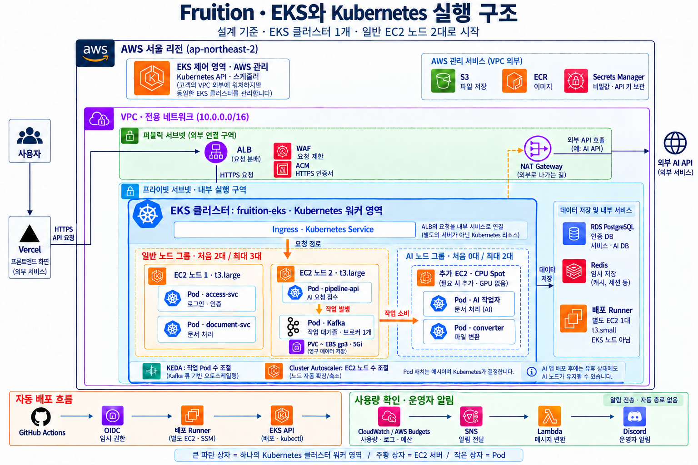
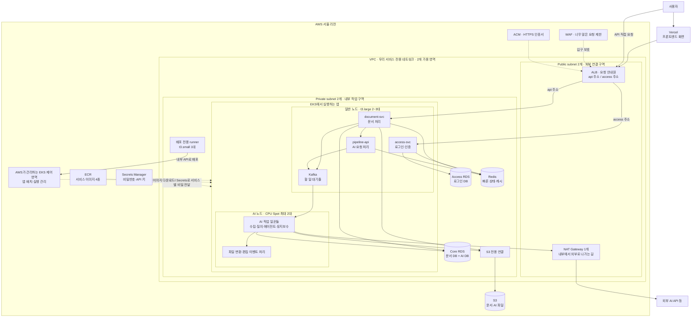
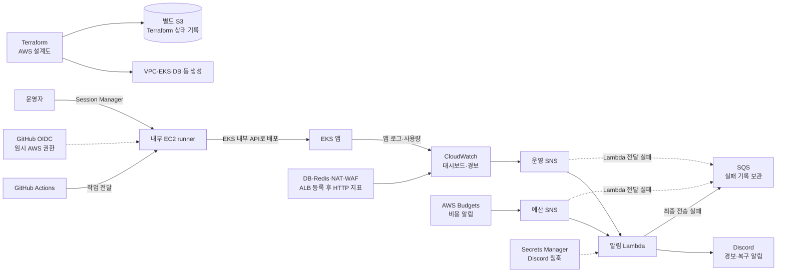

# AWS에 배포하면 어떤 모습일까요?

현재 Terraform과 Kubernetes 설정을 기준으로 그린 **배포 후 목표 구조**입니다. 실제 AWS에 모두 설치됐다는 뜻은 아닙니다. 프론트 화면은 Vercel에서, 백엔드와 AI 작업은 AWS 서울 리전에서 실행합니다.

서버는 일을 하는 컴퓨터, Pod는 그 안에서 일하는 작은 프로그램입니다. 아래 그림은 컴퓨터 한 대 한 대의 정확한 위치가 아니라 각 서비스의 역할과 연결을 보여줍니다. 두 가용 영역(AZ)에 모든 서비스가 똑같이 하나씩 생기는 구조는 아닙니다.

## 이미지로 한눈에 보기

[한글 PNG 원본](images/aws-deployment-architecture-ko.png) · [영문 PNG 원본](images/aws-deployment-architecture.png)

한글 그림은 **하나의 EKS 클러스터 → 일반 EC2 노드 2대 → 각 노드 안에서 실행되는 Pod** 순서로 읽으면 됩니다. 노드별 Pod 배치는 이해를 돕는 예시이며, 실제 배치는 Kubernetes가 결정합니다. 이후 보완으로 API 3종은 각각 2개 Pod가 됐으며, 그림의 Pod 상자는 개수 전체를 나타내지 않습니다. 자세한 현재 설정은 [유지보수 문서](aws-maintenance.md)를 참고하세요. Kafka도 클러스터 안의 Pod로 실행되며, 단일 브로커가 PVC로 연결한 EBS gp3 5Gi에 데이터를 저장합니다. AI 노드는 같은 클러스터에 추가되는 별도 노드 그룹이고, 배포 Runner는 클러스터 밖의 별도 EC2입니다.

주요 비동기 작업 흐름은 **문서 요청 → Pipeline API → Kafka → AI 작업자**입니다. KEDA는 작업 Pod 수를, Cluster Autoscaler는 노드 수를 조절합니다. 영문 이미지는 전체 서비스를 요약한 이전 개념도이며, 노드와 Pod의 상세 구분은 한글 이미지를 참고하세요.

AWS 서비스 아이콘 스타일로 만든 개념도입니다. 공식 AWS 아이콘 원본을 조합한 그림은 아니며, 연결선은 주요 흐름만 나타냅니다. 자세한 서비스 연결은 아래 다이어그램을 참고하세요. 비용·트래픽 알림은 운영자에게 전달되며, 자동으로 전체 서비스를 끄는 기능은 현재 구성에 포함되지 않습니다.

## 서비스가 일하는 모습

실선은 주요 요청·자료 흐름, 점선은 보호·설정·관리 연결입니다. 읽기 쉽게 주요 연결만 그렸습니다. 예를 들어 runner의 GitHub 연결과 Gmail SMTP 같은 다른 외부 통신도 NAT 경로를 사용할 수 있습니다. S3 전용 연결은 자료가 지나가는 경로이며 별도 서버 한 대가 아닙니다.

EKS 관리 부분은 AWS가 운영합니다. 우리 VPC 안에는 앱을 실행하는 노드와 EKS API에 연결할 네트워크 경로가 있습니다.

## 사용자가 요청하면

1. **화면을 엽니다.** Vercel에서 프론트엔드를 받습니다.
2. **서버에 요청합니다.** 공개 API 요청은 WAF가 연결된 ALB로 들어옵니다. 화면을 거치지 않고 직접 API를 호출할 수도 있습니다.
3. **알맞은 담당자에게 갑니다.** `access` 주소는 인증 서비스로, `api` 주소는 문서 서비스로 갑니다.
4. **오래 걸리는 일은 줄을 섭니다.** Kafka에 들어간 작업은 AI 일꾼이 차례로 처리합니다. 모든 요청이 Kafka를 거치는 것은 아닙니다.
5. **결과를 보관합니다.** 중요한 기록은 RDS에, 문서·AI 파일은 S3에 저장합니다. Redis는 빨리 확인할 상태와 캐시에 사용합니다.

## 새 프로그램 설치와 운영 알림

runner는 새 프로그램을 설치하는 담당 컴퓨터입니다. 웹사이트나 AI 모델을 직접 운영하는 서버가 아닙니다. GitHub 작업 중에는 OIDC로 잠시 사용할 AWS 권한을 받습니다. 운영자는 SSH 키 대신 Session Manager로 runner를 관리합니다.

CloudWatch는 컴퓨터의 일기와 사용량을 모읍니다. 문제가 생기거나 해결되면 SNS와 Lambda를 거쳐 Discord에 소식을 보냅니다. 예산 소식은 별도 SNS를 거쳐 같은 Lambda로 갑니다. 실제 웹훅 입력과 수신 시험을 마쳐야 알림 연결이 완료됩니다.

## 크기와 개수

| 구성 | 현재 설정 | 알아둘 점 |
|---|---|---|
| 프론트 | Vercel | AWS 밖에서 운영 |
| 일반 EKS 노드 | t3.large, 처음/최소 2대·최대 3대 | 앱·Kafka·플랫폼 도구 실행 |
| AI EKS 노드 | m5.xlarge 또는 m6i.xlarge Spot, 처음/최소 0대·최대 2대 | GPU 없음. 앱 설치 후 상시 일꾼 때문에 노드가 필요 |
| 인증·문서·AI API Pod | 각각 2개 | 순차 교체·PDB·노드 분산 적용, HPA 미설정 |
| AI 작업 Pod | 수집·질의·에이전트 각각 1~4개, 유지보수 1~2개 | KEDA가 밀린 작업을 보고 조절 |
| runner | t3.small 1대, 암호화 gp3 30GB | 공인 IP 없는 배포 전용 컴퓨터 |
| RDS | db.t4g.small 2대, 각각 암호화 gp3 30GB | PostgreSQL 16, 각각 Single-AZ, 백업 7일 |
| Redis | cache.t4g.micro 1대 | 전송·저장 암호화, 예비 복제본 없음 |
| Kafka | broker/controller 1대, gp3 5Gi | EKS 안에서 실행 |
| ALB | 앱 Ingress로 생성 | HTTPS, 두 API 주소로 요청 분기 |
| NAT Gateway | 1개 | 내부 서비스의 외부 통신 경로 |
| S3 | 앱 파일용과 Terraform 상태용 분리 | 파일용은 S3 전용 연결 사용 |
| ECR | access-svc·document-svc·pipeline·converter 4개 | pipeline 이미지를 여러 AI 일꾼이 함께 사용 |
| CloudWatch | 로그·사용량·대시보드·경보 | 주요 로그 14일 보관, ALB 경보는 생성 후 이름표 등록 필요 |

## 보호 설정과 남은 한계

- **EKS 관리 접근:** 내부 API를 사용합니다. 처음 로컬에서 설치할 때만 관리자 공인 IP 하나(`/32`)를 잠시 허용한 뒤 닫습니다. 사용자용 ALB는 공개 입구로 남습니다.
- **요청 제한:** WAF 기본값은 IP당 5분 600회, 전체 5분 3,000회입니다. 이는 근사적인 요청 제한이며 정확한 요금 상한은 아닙니다.
- **긴급 문닫기:** 운영자가 설정을 바꾸어 공개 API를 막을 수 있습니다. 비용·트래픽 급증에 따른 자동 긴급 차단은 아직 연결하지 않았습니다.
- **비밀정보:** DB·Redis 비밀번호, Gmail 앱 비밀번호, API 키는 Secrets Manager에서 서비스별로 필요한 값만 전달합니다. Discord 웹훅은 별도 Secret입니다.
- **장애 대비:** 두 가용 영역을 사용해도 RDS는 각각 Single-AZ이고 Redis·Kafka·NAT는 각각 1개입니다. 어디가 고장 나도 끊기지 않는 구성은 아닙니다.
- **비용:** 서버 대수에 상한이 있어도 통신량·로그·파일·외부 AI API 비용은 늘 수 있습니다. 예산 알림이 돈을 자동으로 멈추지는 않습니다.

## 무엇이 언제 만들어지나요?

| 단계 | 만드는 것 |
|---|---|
| Terraform state 준비 | 설계 작업의 상태를 보관하는 별도 S3 |
| 메인 Terraform 적용 | VPC, EKS, node group, DB, Redis, runner, S3, ECR, WAF, Secrets Manager, CloudWatch·알림 자원 |
| 플랫폼 설치 | ALB controller, External Secrets, Cluster Autoscaler, Kafka operator, KEDA와 공통 권한 |
| 앱 배포 | 실제 앱 Pod, Service, Ingress, Kafka, 작업별 확장 설정 |
| 앱 설치 뒤 연결 확인 | ALB 생성·WAF/ACM 연결, DNS 연결, ALB 경보 등록, 실제 요청·로그·Discord 수신 시험 |

Terraform만 적용했다고 사용자에게 서비스가 바로 열리는 것은 아닙니다. 위 설치와 연결 확인을 순서대로 마쳐야 합니다.

## 관련 문서와 설계도

- [현재 사양과 비용 보호 설명](aws-deployment-costs.md)
- [CloudWatch·Discord 설정과 시험 순서](aws-observability.md)
- [Terraform 관리 항목 185개 전체 목록](aws-resource-inventory.md)
- [runner 준비·등록 순서](../infra/runner/README.md)
- 설정 원본: [VPC](../infra/terraform/vpc.tf), [EKS](../infra/terraform/eks.tf), [RDS](../infra/terraform/rds.tf), [Redis](../infra/terraform/elasticache.tf), [runner](../infra/terraform/runner.tf), [관측·알림](../infra/terraform/observability.tf), [앱 입구](../k8s/overlays/aws/ingress.yaml), [AWS 앱 배치](../k8s/overlays/aws/kustomization.yaml).
