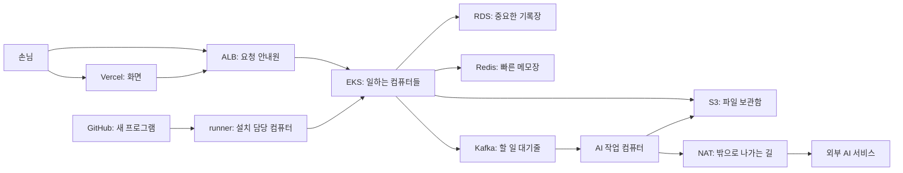

# 우리 서비스는 어디에서 일하고, 돈은 얼마나 들까요?

2026-09-16에 준비한 설정을 설명하는 글입니다. **설정 파일을 만들었다고 AWS에서 모두 켜진 것은 아닙니다.** 실제로 설치하고 시험하는 일이 남아 있습니다.

우리 서비스를 작은 가게라고 생각해 보세요. 손님이 보는 화면은 가게 앞이고, 서버는 뒤에서 일을 하는 컴퓨터입니다. AWS는 이 컴퓨터와 물건을 보관할 곳을 빌려줍니다.

**컴퓨터 수를 제한해도 돈이 무조건 일정해지는 것은 아닙니다.** 손님이 많아지면 보내는 파일과 AI에게 시키는 일도 많아집니다. 그만큼 돈이 더 들 수 있습니다.

## 먼저 알아둘 말

| 말 | 쉽게 말하면 |
|---|---|
| 서버·노드 | 일을 하는 컴퓨터 |
| Pod | 컴퓨터 안에서 실행되는 작은 일꾼. 컴퓨터 한 대에 여러 개가 있을 수 있어요 |
| 배포 | 준비한 프로그램을 컴퓨터에 올려서 일하게 하는 것 |
| 트래픽 | 손님이 보내는 요청과 오가는 파일의 양 |
| 자동 확장 | 일이 쌓이면 정해진 범위 안에서 컴퓨터나 일꾼을 늘리는 것 |
| 로그 | 컴퓨터가 쓴 일기. 무슨 일이 있었는지 기록해요 |
| 암호화 | 열쇠가 있어야 내용을 읽을 수 있게 잠그는 것 |

## 구성 한눈에 보기



손님은 화면을 거치지 않고 서버 입구로 직접 요청할 수도 있습니다. 그래서 화면의 버튼만 막는 것으로는 충분하지 않습니다. 서버 입구에도 제한이 필요합니다.

## 무엇을 몇 개 준비했나요?

상품 이름처럼 보이는 `t3.large` 같은 글자는 컴퓨터 크기의 이름입니다. 이름을 외울 필요는 없습니다.

| 하는 일 | 준비한 크기·개수 | 알아둘 점 |
|---|---|---|
| 컴퓨터를 둘 곳 | AWS 서울, 서로 다른 두 구역(AZ), 바깥/안쪽 공간(subnet) 각각 2개 | 두 구역을 쓴다고 모든 장비에 예비 장비가 있는 것은 아니에요 |
| 일꾼 관리자 EKS | Kubernetes 1.35 | 컴퓨터를 관리하는 부분도 돈이 들어요 |
| 보통 일을 하는 컴퓨터 | t3.large, 처음 2대·최소 2대·최대 3대 | 오래 바쁘면 추가 CPU 요금 대신 속도를 제한하는 Standard 설정이에요 |
| AI 일을 하는 컴퓨터 | m5.xlarge 또는 m6i.xlarge Spot, 처음 0대·최대 2대 | GPU는 없어요. Spot은 AWS 사정에 따라 중단될 수 있어요 |
| 설치 담당 runner | t3.small 1대, 잠긴 gp3 저장 공간 30GB | 외부 공개 IP가 없고 Standard 설정을 써요 |
| 중요한 기록장 RDS | PostgreSQL 16, db.t4g.small 2대, 각각 gp3 30GB | 외부에 열지 않고 암호화해요. 각 DB는 한 구역(Single-AZ)에 있고 백업은 7일 보관해요 |
| 빠른 메모장 Redis | cache.t4g.micro 1대 | 보낼 때와 저장할 때 잠가요. 예비 복사본이나 자동 크기 확대는 없어요 |
| 할 일 대기줄 Kafka | 1대, gp3 저장 공간 5Gi | 할 일이 너무 쌓이면 공간이 모자랄 수 있어요 |
| 요청 안내원 ALB | 앱 입구 설정(Ingress) 1개로 준비 | 앱을 설치할 때 만들어요. 두 API 주소로 요청을 나누고 HTTPS를 써요 |
| 밖으로 나가는 길 NAT | 1개, 고정 공인 IP 1개 | 길을 빌리는 돈과 자료를 옮기는 돈이 들어요 |
| 파일 보관함 S3 | 예전 파일도 보관 | 전체 크기 제한은 없어요. 오래된 파일이 계속 쌓일 수 있어요 |
| 설치용 프로그램 상자 ECR | 서비스별 보관함 4개, 각각 최근 10개 보관 | 상자 10개의 크기는 서로 다를 수 있어요. 같은 이름표의 내용을 덮어쓰지 못하게 했어요 |
| Terraform 기록장 | 별도 S3에 보관, 암호화·이전 기록 보관·동시 수정 잠금 | 사용자가 올리는 파일 보관함과 달라요 |
| 돈 알림 | 계정 전체 월 사용료 $400 / $550 / $650 초과 | Discord에 알리는 설정이에요. 돈을 자동으로 멈추지는 않아요 |

일반 컴퓨터 3대와 AI 컴퓨터 2대는 보통의 자동 확장 한도입니다. runner 1대는 따로 있습니다. 컴퓨터를 교체하는 동안 잠깐 더 생기는 것까지 막는 계정 전체의 절대 제한은 아닙니다.

## Kubernetes 확장 범위

컴퓨터를 늘리는 것과 그 안의 일꾼을 늘리는 것은 다릅니다.

| 일꾼 이름 | 준비한 수 | 어디에서 일하나요? |
|---|---|---|
| access-svc / document-svc / pipeline-api | 각각 2개 고정, 교체 중 임시 1개 추가 | 일반 컴퓨터 |
| ingest-worker / query-task-worker / agent-task-worker | 각각 1~4개 | AI 컴퓨터 |
| maintenance-task-worker | 1~2개 | AI 컴퓨터 |
| converter / edit-event-consumer / pipeline-agent-worker | 각각 1개 고정 | AI 컴퓨터 |

**KEDA**는 대기줄에 일이 쌓였는지 보고 일꾼을 늘립니다. **Cluster Autoscaler**는 일꾼이 들어갈 자리가 부족할 때 컴퓨터를 늘립니다. 둘 다 설치하고 정상 동작을 확인해야 합니다.

AI 컴퓨터는 처음에 0대로 시작하지만, 앱을 설치하면 항상 자리가 필요한 일꾼들이 생깁니다. 따라서 **손님이 없어도 AI 컴퓨터가 계속 켜져 있을 수 있습니다.** 일부 일꾼만 0개로 바꿔도 나머지 일꾼이 있으면 컴퓨터가 필요합니다.

일꾼이 쓸 메모리에는 제한이 있습니다. 앱별 CPU 제한과 전체 작업 공간의 공통 제한(ResourceQuota/LimitRange)은 아직 없습니다. 자리가 다 차면 새 일이 기다리거나 실패할 수 있습니다. 일꾼 수를 제한해도 외부 AI에게 묻는 횟수나 글자 처리 비용까지 제한되지는 않습니다.

## 돈이 많이 들 수 있는 곳

| 무슨 일이 생기나요? | 왜 돈이 더 들 수 있나요? |
|---|---|
| 요청이 갑자기 많아짐 | ALB가 안내할 일이 늘고 인터넷으로 보내는 자료도 늘어요 |
| AI에게 계속 일을 시킴 | AI를 빌려 쓰는 회사가 요청·토큰 사용량에 따라 청구해요. 토큰은 글을 세는 작은 단위예요 |
| 큰 파일을 자주 옮김 | NAT 길과 인터넷을 쓰는 양이 늘어요 |
| DB가 오래 바쁘게 일함 | 현재 RDS T4g 상품은 추가 CPU 사용료가 생길 수 있어요 |
| 파일을 계속 올리거나 고침 | 새 파일뿐 아니라 예전 파일도 보관하므로 공간이 늘어요 |
| 컴퓨터가 일기를 아주 많이 씀 | 로그를 모으고 저장하고 찾아보는 데도 돈이 들어요 |
| 대기줄·DB 공간이 꽉 참 | 서비스가 멈출 수 있어요. 실패한 일을 계속 다시 시도하면 다른 비용도 늘 수 있어요 |

작은 자료도 아주 많이 보내면 커집니다. **초당 100번 × 한 번에 1MB × 한 시간은 약 360GB**입니다. 이 숫자는 자료의 양을 보여주는 예시이지 요금 견적은 아닙니다. [ALB 요금 설명](https://aws.amazon.com/elasticloadbalancing/pricing/)

S3 전용 길(Gateway endpoint)을 쓰면 해당 S3 통신은 NAT를 거치지 않아 NAT 처리 비용을 줄일 수 있습니다. S3 저장·요청 요금은 남습니다. 손님에게 보내는 ALB 응답을 모두 NAT 사용량으로 한 번 더 세면 안 됩니다. [NAT 설명](https://docs.aws.amazon.com/vpc/latest/userguide/nat-gateway-pricing.html), [S3 전용 길 설명](https://docs.aws.amazon.com/vpc/latest/privatelink/gateway-endpoints.html)

일반 EC2와 runner는 추가 CPU 요금 대신 속도를 제한하는 Standard 설정입니다. DB의 RDS T4g는 같은 설정이 아니므로 추가 CPU 비용을 따로 봐야 합니다. [EC2 T3](https://aws.amazon.com/ec2/instance-types/t3/), [RDS 요금](https://aws.amazon.com/rds/postgresql/pricing/)

S3에서 지금 보이는 파일을 지워도 예전 버전이 남을 수 있습니다. `tmp/`의 7일 정리만으로 모든 문서·AI 결과·예전 버전이 지워지는 것은 아닙니다. [S3 보관 규칙](https://docs.aws.amazon.com/AmazonS3/latest/userguide/intro-lifecycle-rules.html)

**예산 알림은 잔액이 떨어지면 멈추는 선불카드가 아닙니다.** 비용 정보는 늦게 들어올 수 있습니다. AWS 안내상 하루 최대 3회, 보통 8~12시간 간격으로 갱신되어 갑자기 늘어난 비용을 바로 막지 못합니다. [AWS 예산 안내](https://docs.aws.amazon.com/cost-management/latest/userguide/budgets-managing-costs.html)

## 추가한 비용 보호 설정과 적용 방법

**WAF는 입구의 문지기입니다.** 너무 많은 요청이 오면 잠시 거절합니다. 아래 값은 작은 시험 서비스용 시작값입니다. 실제 사용자를 받아 보기 전에 시험하고 조정해야 합니다.

| 설정 이름 | 지금 값 | 쉽게 풀면 |
|---|---|---|
| `waf_requests_per_ip_5m` | 600 | 같은 접속 IP에서 5분 동안 너무 많이 요청하면 429로 거절해요 |
| `waf_requests_total_5m` | 3000 | 두 API 주소의 요청을 합쳐 5분 동안 너무 많으면 429로 거절해요 |
| `waf_emergency_block` | false | 긴급 문닫기 스위치는 꺼져 있어요. true로 바꾸고 적용하면 공개 API를 403으로 막아요 |
| EC2 CPU credit | Standard | 일반 컴퓨터·runner가 오래 바쁘면 속도를 줄여 추가 CPU 요금을 막아요 |
| S3 Gateway endpoint | 안쪽 경로에 연결 | S3 자료는 전용 길로 보내요 |
| 미완료 multipart 업로드 | 시작 후 7일 | 조각만 보내 놓고 끝내지 않은 업로드를 정리해요. 완료된 파일은 이 규칙으로 지우지 않아요 |

429는 “요청이 너무 많아요”, 403은 “이 요청은 허용하지 않아요”라는 응답입니다. WAF가 정확히 600번째 또는 3,000번째에서 즉시 문을 닫는 것은 아닙니다. 판단하고 전달하는 시간이 있습니다. [WAF 요청 제한](https://docs.aws.amazon.com/waf/latest/developerguide/waf-rule-statement-type-rate-based.html)

여러 손님이 Vercel 같은 중간 서버를 거치면 같은 IP로 보일 수 있습니다. 이때 정상 손님들도 함께 제한될 수 있습니다. IP라고 적힌 요청 글자(`X-Forwarded-For`)를 아무 확인 없이 믿도록 하지는 않았습니다. 문지기 WAF 자체에도 사용료가 있습니다. [WAF 요금](https://aws.amazon.com/waf/pricing/)

### 운영자가 실행하는 순서

여기부터는 실제 설치 명령입니다. 코드 안의 영어 이름은 컴퓨터가 읽으므로 바꾸지 않습니다.

1. 필요하면 `feedback.tfvars`에서 위 WAF 값 세 개를 바꿉니다.
2. 새 계획을 만듭니다. 기존 plan은 나중에 바꾼 설정을 자동으로 담지 않습니다.

   ```bash
   terraform -chdir=infra/terraform plan -var-file=feedback.tfvars -out=feedback-cost-guards.tfplan
   ```

3. 만들 것·바꿀 것·지울 것을 확인한 뒤 적용합니다. **apply부터 실제 자원을 만들고 요금이 생길 수 있습니다.** 이 명령은 WAF만이 아니라 같은 폴더의 전체 인프라에 적용됩니다. 이미 쓰는 컴퓨터가 있다면 교체·성능 변화도 확인합니다.

   ```bash
   terraform -chdir=infra/terraform apply feedback-cost-guards.tfplan
   terraform -chdir=infra/terraform output -raw waf_acl_arn
   ```

4. 출력된 ARN을 배포 JSON의 `waf_acl_arn`에 넣습니다. ARN은 AWS 물건의 긴 이름표입니다. GitHub의 `AWS_DEPLOY_CONFIG_JSON`에도 넣습니다. 빠져 있거나 다른 계정·리전의 이름표이면 배포 검사가 멈춥니다. 예전 배포로 되돌릴 때도 이 새 입력값이 필요합니다.
5. 앱 배포 후 WAF가 ALB 입구에 실제로 붙었는지 확인합니다. WAF만 만들고 연결하지 않으면 문을 지키지 못합니다. `<ALB_ARN>`은 실제 ALB 이름표로 바꿉니다.

   ```bash
   aws wafv2 get-web-acl-for-resource --region ap-northeast-2 --resource-arn <ALB_ARN>
   ```

6. 별도 시험 환경에서 요청 제한과 다시 정상으로 돌아오는 것을 확인합니다. `AllowedRequests`는 통과한 수, `BlockedRequests`는 막은 수입니다.
7. 급할 때는 `waf_emergency_block = true`로 바꾸고 새 계획을 확인한 뒤 적용합니다. 열 때는 false로 되돌려 다시 적용합니다. **이미 시작한 일과 대기줄에 있는 일은 이 스위치만으로 멈추지 않습니다.**

WAF가 살펴본 개별 요청을 표본으로 저장하는 기능은 껐습니다. 요청 수 기록은 켰습니다. WAF 요청 로그는 14일 보관하며, Authorization·Cookie·X-API-Key·query는 가립니다. 차단 건수 알림은 [CloudWatch 문서](aws-observability.md)에 있습니다.

## 손님을 받기 전에 더 해야 할 일

1. **AI 용돈 제한:** 사용자마다 하루에 시킬 수 있는 일·토큰·금액을 제한해야 합니다. 동시에 여러 일을 보내도 한도를 넘지 못하게 하고, 실패한 일의 반복 횟수도 제한해야 합니다. 아직 이 문서만으로 완료된 것은 아닙니다.
2. **파일 크기 제한:** 한 번에 올릴 크기·개수와 한 사람이 보관할 총량을 정해야 합니다.
3. **알림 시험:** Discord 웹훅을 넣고 진짜로 알림이 오는지 확인해야 합니다. Kafka 대기줄·디스크, AI 호출량, CPU credit 등 아직 연결하지 않은 기록도 보완해야 합니다.
4. **요금 다시 계산:** 평소와 아주 바쁠 때를 나눠 계산해야 합니다. AI 컴퓨터가 계속 켜지는 시간도 넣습니다. 월 730시간 같은 계산 기준과 세금·환율·Spot 가격 변화를 따로 표시합니다.

기존 **월 $500~650은 예상치이며 최대 금액 보장이 아닙니다.** Vercel과 외부 AI API 사용료는 별도입니다. CloudWatch 수집 비용도 함께 다시 계산해야 합니다.

## 갑자기 바빠지면 어떻게 하나요?

먼저 그래프를 보고 요청·파일·AI 작업 중 무엇이 늘었는지 찾습니다. 비용 화면에 숫자가 나올 때까지 기다리지 않습니다. 원인이 된 요청을 줄이고, 필요하면 새 API 요청을 막습니다.

일꾼을 직접 멈출 때는 KEDA가 다시 늘리지 않도록 함께 확인해야 합니다. 컴퓨터를 강제로 꺼도 Auto Scaling이 다시 만들 수 있습니다. AI API 키를 막으면 다른 정상 작업도 멈출 수 있습니다.

문을 닫아도 컴퓨터·DB·NAT·저장소를 빌린 기본 비용은 남습니다. 돈이 넘었다고 모든 자원을 자동 삭제하면 중요한 자료를 잃을 수 있습니다. 해결 후에는 남아 있는 대기줄과 중복 실행을 살피며 천천히 다시 엽니다.

## 지금 어디까지 했나요?

- Terraform 상태 기록용 S3와 연결은 완료를 확인했습니다.
- 비용 보호만 담았던 계획은 157개였습니다. 이후 CloudWatch를 넣은 계획은 **185개**입니다. 둘 다 개수가 곧 요금은 아닙니다.
- RDS 암호화와 보호 설정은 최신 계획에 들어 있는지 확인한 뒤 적용해야 합니다.
- 실제 서비스 설치·많은 요청 시험·Discord 수신 확인은 별도 단계입니다. 자동 긴급 차단은 아직 연결하지 않았습니다.

더 볼 곳: [전체 185개 목록](aws-resource-inventory.md), [CloudWatch 안내](aws-observability.md), [runner 설치 순서](../infra/runner/README.md), [운영 설계 기록](adr/0021-aws-observability-and-operations.md).

설정 파일: [EKS](../infra/terraform/eks.tf), [runner](../infra/terraform/runner.tf), [RDS](../infra/terraform/rds.tf), [Redis](../infra/terraform/elasticache.tf), [길 설정](../infra/terraform/vpc.tf), [앱 입구](../k8s/overlays/aws/ingress.yaml), [S3](../infra/terraform/s3.tf), [ECR](../infra/terraform/ecr.tf), [예산](../infra/terraform/budgets.tf), [비용 보호](../infra/terraform/cost-guards.tf), [배포 검사](../scripts/aws_deploy.py), [일꾼 수 조절](../k8s/base/keda-scaledobject.yaml), [AWS 앱 설정](../k8s/overlays/aws/kustomization.yaml), [대기줄](../k8s/base/kafka.yaml).
