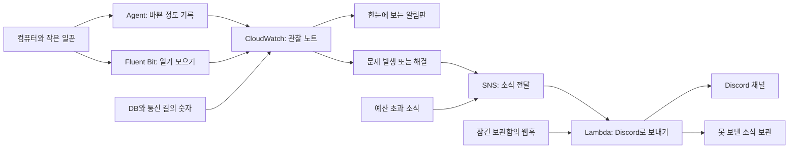

# 컴퓨터가 잘 일하는지 보고, Discord로 소식 받기

CloudWatch는 컴퓨터를 살펴보는 **관찰 노트와 알림판**입니다. 컴퓨터가 너무 바쁜지, 무슨 일이 있었는지 보여줍니다. 문제가 생기면 Discord에 소식을 보내도록 준비했습니다.

2026-09-16 기준으로 **설정 파일과 검사는 준비했습니다. 실제 AWS 설치와 알림 수신 시험은 별도입니다.** 컴퓨터와 앱을 아직 만들지 않았다면 모을 기록도 없습니다. 이 알림이 자동으로 서버를 끄거나 API 문을 닫지는 않습니다.

## 먼저 알아둘 말

| 이름 | 하는 일 |
|---|---|
| 로그 | 컴퓨터가 쓴 일기. 오류나 작업 기록이에요 |
| 지표 | “얼마나 바쁜가요?”를 나타내는 숫자예요 |
| CPU | 계산하는 힘이에요 |
| 메모리 | 지금 일하면서 쓰는 책상이에요 |
| 대시보드 | 여러 숫자와 그래프를 한곳에 모은 알림판이에요 |
| 경보 | 정해 둔 숫자를 넘으면 울리는 벨이에요 |
| SNS | 알림을 전달하는 우체부예요 |
| Lambda | 알림을 받아 Discord로 보내는 작은 프로그램이에요 |
| 웹훅 | Discord의 특정 채널에 소식을 보낼 수 있는 비밀 주소예요 |
| Secrets Manager | 웹훅이나 비밀번호를 넣는 잠긴 보관함이에요 |
| SQS | 보내지 못한 알림을 잠시 넣어 두는 상자예요 |

## 소식은 어떻게 오나요?



실제 설정에서는 예산 소식과 운영 소식을 서로 다른 SNS 길로 보낸 뒤 같은 Lambda에서 받습니다.

## 무엇을 모으나요?

| 대상 | 모으는 것·설정 |
|---|---|
| EKS 컴퓨터와 Pod 일꾼 | CPU·메모리 등 사용량. 60초 간격으로 모으도록 설정했어요 |
| 앱 | 화면 출력처럼 남기는 stdout/stderr 로그를 모아요 |
| 컴퓨터 자체 | 운영체제(host), 컴퓨터 안 통신·실행 부분(dataplane)의 기록을 모아요. 실제 나오는 기록은 설치 후 확인해요 |
| 기록 보관 기간 | 아래 4개 기록함과 EKS 관리 기록, 알림 Lambda 기록은 14일이에요 |
| 알림판 | 이름은 `fruition-operations`예요. 사용량·문제·최근 앱 기록을 봐요 |
| 수집 도구 | CloudWatch addon `v6.6.0-eksbuild.1`. AWS 서울의 EKS 1.35에서 쓸 수 있는 버전을 조회했어요 |
| 수집 권한 | CloudWatch Agent와 Fluent Bit에게 전용 출입증(IRSA)을 줘요. 정책 이름은 `CloudWatchAgentServerPolicy`예요 |
| 추가 비용 줄이기 | Application Signals, 자동 상세 추적(trace), GPU 기록, 중복 OTEL 수집은 껐어요 |

기록함 이름은 다음과 같습니다. AWS 콘솔에서 찾을 때 사용합니다.

```text
/aws/containerinsights/fruition-eks/application
/aws/containerinsights/fruition-eks/host
/aws/containerinsights/fruition-eks/dataplane
/aws/containerinsights/fruition-eks/performance
```

컴퓨터 안의 아무 파일이나 전부 읽는 것은 아닙니다. Pod 안에 따로 저장한 파일, S3의 `pipeline-runs/...` 파일, Vercel 기록, runner 컴퓨터의 OS 기록은 자동으로 합쳐지지 않습니다. 앱이 필요한 기록을 stdout/stderr로 남겨야 합니다.

**일기에 비밀번호를 쓰면 안 됩니다.** 이 수집기가 앱 로그의 비밀번호·개인정보를 저절로 가려주지는 않습니다. AI 작업 한 번의 요금, Kafka에 밀린 일 수, 요청의 자세한 이동 기록도 별도 준비가 필요합니다.

## 경보 초기값

숫자를 5분씩 모아 봅니다. “3번”은 약 15분, “2번”은 약 10분입니다. 기록이 도착하고 알림이 오는 시간이 더 걸릴 수 있습니다.

| 무엇을 보나요? | 언제 알리나요? | 몇 번 연속 보나요? |
|---|---|---|
| 컴퓨터 CPU | 평균 80% 초과 | 3번 |
| 컴퓨터 메모리 | 최대 85% 초과 | 3번 |
| fruition Pod CPU·메모리 | 각각 최대 80%·85% 초과 | 3번 |
| 고장 난 컴퓨터 | 1대 이상 | 2번 |
| 수집기가 소식을 안 보냄 | 컴퓨터 CPU 표본이 없음 또는 1개 미만 | 3번 |
| 각 RDS 기록장 | CPU 평균 80% 초과 / 빈 공간 최소 5GiB 미만 | 3번 / 2번 |
| Redis 메모장 | 메모리 최대 80% 초과 | 2번 |
| NAT 바깥길 | 5분에 밖으로 1GiB보다 많이 보냄 | 1번 |
| WAF 문지기 | 5분에 100건보다 많이 막음 | 1번 |
| 앱의 일기 | 5분에 100MiB보다 많이 들어옴 | 1번 |
| ALB 안내원 | 5분에 서버 오류(5xx) 10건 초과 또는 요청 2,000건 초과 | 1번 |
| ALB 안내원 | 평균 응답 시간이 2초 초과 | 3번 |
| Discord 실패 상자 | 못 보낸 소식이 1개 이상 | 1번, 알림판에서 확인 |

GiB와 MiB는 자료의 크기를 세는 단위입니다. GiB가 더 큽니다. **ALB 경보는 ALB를 만든 뒤 이름표를 입력해야 켜집니다.** 숫자를 바꾸려면 [observability.tf](../infra/terraform/observability.tf)의 `operations_metrics`를 고칩니다.

Pod 사용률은 AWS Container Insights가 계산하는 방식입니다. 앱에 정한 CPU 한도의 몇 퍼센트인지를 뜻하지는 않습니다. 오래 답하는 AI 요청은 ALB 응답 시간에 영향을 줄 수 있습니다. NAT 숫자는 밖으로 보낸 양이며 전체 통신량이나 청구액은 아닙니다.

손님이 없어 WAF·ALB 숫자가 안 나오는 경우는 정상으로 봅니다. CPU·DB 숫자가 없으면 “아직 판단할 자료가 없음”으로 두고, 수집 중단 전용 경보가 따로 살펴봅니다. 처음 설치하는 동안에도 수집 중단 소식이 올 수 있습니다.

## 알림을 못 보내면 어떻게 하나요?

문제가 생기면 **ALARM**, 좋아지면 **OK** 소식을 보냅니다. 메시지에 `@everyone`이 있어도 사람들을 자동 호출하지 않도록 했습니다. 웹훅 주소도 실행 로그에 쓰지 않습니다.

보내기에 실패하면 Lambda가 최대 2번 더 시도합니다. 이벤트는 최대 1시간 동안 처리하고, 최종 실패 기록은 SQS 상자에 14일 보관합니다. SNS에서 Lambda로 못 보낸 기록도 이 상자로 보냅니다.

Discord 자체가 고장 나면 Discord로 “Discord가 고장 났어요”를 확실히 보낼 수 없습니다. 그래서 실패 상자 경보는 CloudWatch 알림판에서 직접 확인하게 했습니다. 같은 실패 알림이 끝없이 다시 생기는 것도 막습니다.

## 1. 최신 Terraform 계획 적용

여기부터는 운영자가 터미널에서 하는 일입니다. **코드 안의 영어 이름은 그대로 사용하세요.** `plan`은 만들 목록을 보는 명령이고, `apply`는 실제 만드는 명령입니다.

먼저 새 계획을 만듭니다. 오래된 `feedback.tfplan`이나 `feedback-cost-guards.tfplan`에는 이번 관찰 도구 설정이 없을 수 있습니다.

```bash
umask 077
terraform -chdir=infra/terraform init -backend-config=feedback.tfbackend -lockfile=readonly
terraform -chdir=infra/terraform plan -var-file=feedback.tfvars -out=feedback-observability.tfplan
```

목록을 확인한 뒤 아래를 실행합니다. **관찰 도구뿐 아니라 아직 없는 EKS·DB 등 전체도 만들 수 있고, 사용료가 생깁니다.** 바꾸거나 지우는 대상도 먼저 확인하세요.

```bash
terraform -chdir=infra/terraform apply feedback-observability.tfplan
terraform -chdir=infra/terraform output observability
```

같은 이름의 기록함을 AWS 콘솔에서 이미 만들었다면, Terraform이 그 물건을 알도록 등록(import)해야 합니다. 기존 설정을 무조건 덮어쓰지는 마세요. addon 갱신은 기존 수정을 보존하는 `PRESERVE` 방식이라 실제 값이 계획과 같은지도 확인합니다.

## 2. Discord 웹훅 입력 (운영자)

1. Discord에서 알림을 받을 채널을 엽니다.
2. **채널 편집 → 연동 → 웹후크**에서 웹훅을 만들고 주소를 복사합니다.
3. AWS 콘솔에서 **서울 리전 → Secrets Manager → fruition/budget-discord-webhook**을 엽니다.
4. **비밀 값 검색/설정 → 일반 텍스트**에 URL 한 줄만 넣습니다. JSON 모양으로 감싸지 않습니다.

허용하는 주소 모양은 `https://discord.com/api/webhooks/...`입니다. 예산 소식과 운영 소식 모두 이 주소로 갑니다. Terraform은 비밀 보관함만 만들고, 주소는 운영자가 넣습니다. 주소를 채팅·Git·tfvars·배포 JSON에 적지 마세요.

## 3. 실제 알림 수신 시험 (운영자)

실제 장애를 만들 필요는 없습니다. 시험용 벨을 울려서 Discord에 도착하는지 봅니다.

```bash
aws cloudwatch set-alarm-state --region ap-northeast-2   --alarm-name fruition-ops-notification_test   --state-value ALARM --state-reason 'Operator notification delivery test'
```

Discord에서 **AWS 운영 경보 [ALARM]**이 오면, “이제 괜찮아요”도 시험합니다.

```bash
aws cloudwatch set-alarm-state --region ap-northeast-2   --alarm-name fruition-ops-notification_test   --state-value OK --state-reason 'Operator notification recovery test'
```

상태가 바뀔 때 소식이 나갑니다. 이미 OK인데 또 OK라고 하면 새 소식이 안 올 수 있습니다. CloudWatch가 먼저 정상 상태로 되돌릴 수도 있고, 소식이 중복해서 올 수도 있습니다.

이 시험은 **소식을 보내는 길**을 확인합니다. 정말 컴퓨터가 바빠졌을 때 벨이 잘 울리는지, 기록이 끊기면 알아채는지는 별도 시험 환경에서 확인해야 합니다.

소식이 안 오면 `/aws/lambda/fruition-budget-discord` 기록, `fruition-budget-alert-failures` 상자, SNS 연결, 웹훅 저장 모양을 확인합니다. 주소를 고쳐도 상자 안의 옛 소식이 자동으로 다시 보내지는 것은 아닙니다. SNS와 Lambda 실패 기록은 모양이 다릅니다. [실패 복구 순서](../infra/lambda/budget_discord/README.md)를 따릅니다.

## 4. 수집·대시보드 확인

```bash
aws eks describe-addon --region ap-northeast-2 --cluster-name fruition-eks   --addon-name amazon-cloudwatch-observability --query 'addon.{Status:status,Health:health}'
kubectl -n amazon-cloudwatch get pods -o wide
terraform -chdir=infra/terraform output observability
```

addon의 `ACTIVE`는 설치가 켜진 상태, Pod의 `Ready`는 일할 준비가 된 상태입니다. 일반 컴퓨터와 AI Spot 컴퓨터 양쪽에 기록을 모으는 일꾼이 있는지 봅니다. AI 컴퓨터에도 들어갈 수 있는 설정(toleration)을 넣었습니다.

출력된 대시보드 주소를 열고 최근 1시간을 봅니다. 앱 설치 후에는 `fruition` 앱 이름과 시간, 메시지가 실제 기록과 맞는지 확인합니다. 화면이 생겼다는 것만으로 수집 성공은 아닙니다. **새로운 숫자와 기록이 계속 들어와야 합니다.**

## 5. 앱 ALB 생성 후 HTTP 경보 활성화

ALB는 손님의 요청을 안내하는 입구입니다. 앱 입구(Ingress)를 설치한 뒤 생성됩니다.

AWS 콘솔 **EC2 → Load Balancers**에서 해당 ALB의 ARN을 찾습니다. ARN은 긴 이름표입니다. 그중 `...:loadbalancer/` 뒤에 있는 `app/이름/ID`를 복사해 로컬 `feedback.tfvars`에 넣습니다.

```hcl
observability_alb_arn_suffix = "app/실제-ALB-이름/실제ID"
```

새 plan을 확인하고 적용하면 ALB의 요청 수·서버 오류·평균 응답 시간 경보가 생깁니다. 비워 두면 다른 기록은 모으지만 ALB 경보는 생기지 않습니다. ALB를 새로 만들면 이름표도 다시 확인합니다.

출력의 `alb_alarms_enabled = true`를 확인하고 실제 요청 숫자가 들어오는지도 봅니다.

## 완료 기준과 비용

다음 다섯 가지가 모두 되어야 “잘 연결됐어요”라고 말할 수 있습니다.

1. 수집 도구가 ACTIVE이고 필요한 일꾼들이 Ready입니다.
2. 그래프와 앱 일기에 새 기록이 들어옵니다.
3. Discord에 ALARM과 OK 소식이 모두 도착합니다. 실패 상자는 비어 있습니다.
4. ALB 이름표를 넣고 실제 HTTP 숫자와 경보를 확인했습니다.
5. 운영자가 알림판 주소와 문제를 고치는 순서를 알고 있습니다.

관찰 노트도 무료로 무한히 쓸 수는 없습니다. 숫자 수집, 로그 저장·검색, 대시보드, 경보, SNS·Lambda·Secret에 비용이 생깁니다. 14일 뒤 지운다고 처음 기록을 받아 온 비용까지 없어지지는 않습니다. 로그를 찾을 때는 짧은 시간 범위로 보고 불필요하게 계속 새로고침하지 마세요. [CloudWatch 요금](https://aws.amazon.com/cloudwatch/pricing/)

자동 긴급 차단, 사람마다 정하는 AI 용돈 한도, 인증 서비스 일꾼 자동 늘리기(HPA)는 별도 작업입니다. 이 문서가 준비됐다고 그 기능들까지 끝난 것은 아닙니다.

더 자세한 원래 설명: [AWS 수집 도구 설치](https://docs.aws.amazon.com/AmazonCloudWatch/latest/monitoring/install-CloudWatch-Observability-EKS-addon.html), [사용량 숫자의 뜻](https://docs.aws.amazon.com/AmazonCloudWatch/latest/monitoring/Container-Insights-metrics-EKS.html).
