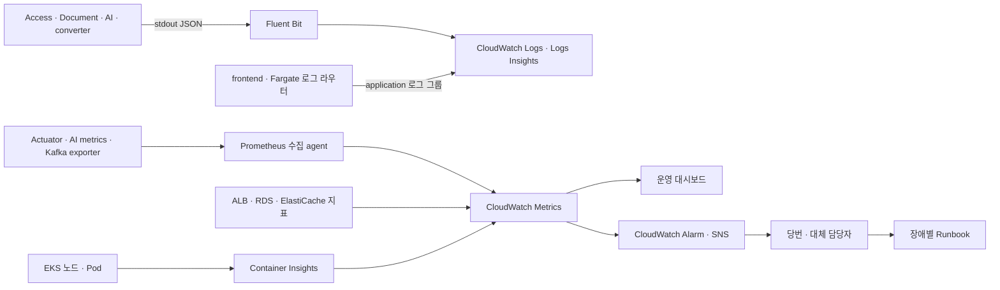

# AWS 운영 보완 계획 (계획 수립 시점 기록)

2026-10-06 backlog 이관. `docs/architecture.md`의 "AWS 운영 보완 계획"과 `docs/script.md`의 "AWS 운영 보완 실행 계획"을 원문 그대로 옮겼다. "현재 근거" 열과 상태 문구는 계획 수립 당시 기준이며, 이후 CloudWatch 관측·알람/SNS·API HPA/PDB·Redis replica·Access RDS Multi-AZ·이미지 게시 CI가 구현됐다. 현행 구성은 [architecture.md](../architecture.md)·[aws-observability.md](../aws-observability.md)·[aws-maintenance.md](../aws-maintenance.md)를 따른다.

### AWS 운영 보완 계획

상태: **계획 수립 시점의 기록이며 일부는 이후 구현됐다.** 아래 "현재 근거" 열은 계획 수립 당시 상태다. 2026-10-06 기준 저장소에는 CloudWatch Observability add-on·14일 보존 로그 그룹·운영 알람/SNS/대시보드(`infra/terraform/observability.tf`, EKS 제어 영역 로그도 14일), API HPA·PDB·2 replica(`k8s/overlays/aws/api-*.yaml`), Redis replica·Access RDS Multi-AZ, 이미지 게시 CI와 digest 포함 release 기록(`.github/workflows/publish-images.yml`)이 들어 있다. 항목별 완료 판정은 갱신하지 않았다. 소규모 feedback 환경을 출발점으로 하며, 현재 단일 Pod·단일 AZ 구성을 상시 무중단 운영 수준으로 간주하지 않는다. 여기서 RB는 Runbook으로 정의하고 RBAC와 배포 Rollback도 별도 작업으로 포함한다.

#### 확인된 부족 항목

| ID | 현재 근거 | 부족 사항·영향 |
|---|---|---|
| OPS-01 | [플랫폼 설치](../../scripts/aws-platform-up.sh), [EKS 설정](../../infra/terraform/eks.tf) | 애플리케이션 로그 수집기·조회용 로그 그룹·보존 정책이 없다. EKS 모듈 20.37.2 기본값의 `api/audit/authenticator`, 90일 보존은 제어 영역 로그이며 Pod 실행 로그를 포함하지 않는다 |
| OPS-02 | [로컬 모니터링](../../infra/compose.monitoring.yml), [스크레이프 설정](../../infra/monitoring/prometheus.yml) | Grafana·Prometheus는 로컬용이다. AWS 수집 대상·대시보드가 없고, AI 작업 성공·실패·오래된 대기 작업을 직접 감시하는 운영 지표가 부족하다 |
| OPS-03 | [예산 알림](../../infra/terraform/budgets.tf) | 비용 알림만 있다. API 장애·큐 정체·DB 용량·수집기 중단의 알림과 수신 담당자가 없다 |
| OPS-04 | [운영 절차](../script.md), [배포 RBAC](../../k8s/platform/aws/deploy-rbac.yaml) | 배포·일부 복구 절차는 있으나 장애별 판정·완화·에스컬레이션·복구 확인이 일관되지 않다. 로그 조회 전용 운영자와 긴급 변경 역할도 미정이다 |
| OPS-05 | [RDS](../../infra/terraform/rds.tf), [S3](../../infra/terraform/s3.tf), [Redis](../../infra/terraform/elasticache.tf) | RDS 7일 백업·삭제 방지와 S3 버전 관리는 있으나 복원·연결 전환 훈련이 없다. Access RDS와 Core RDS의 공통 복원 시점, S3·Kafka와의 정합성, Redis 소실 후 재구성 범위가 검증되지 않았다 |
| OPS-06 | [변환 큐](https://github.com/FruitionKR/Fruition-document/blob/main/src/main/java/fruition/core/document/service/DocumentConvertWorker.java), [편집 outbox](https://github.com/FruitionKR/Fruition-document/blob/main/src/main/java/fruition/core/document/service/PostgresDocumentEditOutboxPublisher.java) | 변환 큐는 전체 `processing` 재설정과 잠금 없는 pending 선택을 사용한다. 편집 outbox도 잠금 없는 조회다. 롤링 배포·다중 Pod에서 중복 실행 위험이 있어 HPA보다 먼저 보완해야 한다. AI command outbox의 기존 잠금 보완과는 다른 경로다 |
| OPS-07 | [AWS overlay](../../k8s/overlays/aws/kustomization.yaml), [KEDA](../../k8s/base/keda-scaledobject.yaml), [Kafka](../../k8s/base/kafka.yaml) | API HPA·PDB가 없고 API·Kafka·Redis는 단일 인스턴스, RDS는 Single-AZ다. KEDA는 일부 worker만 확장한다. Pod 증설만으로 DB·브로커 장애를 해결할 수 없다 |
| OPS-08 | [배포기](../../scripts/aws_deploy.py), [workflow](../../.github/workflows/deploy.yml) | 서비스별 SHA release manifest와 서비스 이미지 게시 CI가 없다. 현재 smoke는 OpenAPI 조회 중심이고, rollback은 같은 DB 스키마에서만 가능하다 |
| OPS-09 | [Fargate 로그](../../k8s/platform/aws/fargate-logging.yaml), [로그 필터](https://github.com/FruitionKR/Fruition-document/blob/main/src/main/java/fruition/shared/logging/HttpRequestLoggingFilter.java) | frontend는 Fargate 내장 로그 라우터로 CloudWatch application 로그 그룹에 들어간다. HTTP 요청 ID는 일부 준비됐지만 브라우저→ALB→업무 API→Kafka→worker의 일관된 추적 계약과 오류 연결 검증이 없다 |

#### 목표 운영 구성

초기 AWS 운영 조회 화면은 CloudWatch로 통일한다. CloudWatch Observability EKS add-on으로 컨테이너 로그·노드/Pod 지표를 수집하고 Logs Insights·Dashboard·Alarm을 사용한다. 기존 Prometheus 형식의 앱 지표는 CloudWatch agent의 Prometheus 수집 설정으로 연결한다. 로컬 Prometheus·Grafana는 개발용으로 유지하며 AWS에 별도 Grafana·Loki·Elasticsearch 서버를 추가하지 않는다. 선택 근거는 [ADR-0021](../adr/0021-aws-observability-and-operations.md)을 따른다.



Fargate에는 DaemonSet 수집기(Fluent Bit)가 돌지 않으므로 frontend 로그는 EKS 내장 로그 라우터(`k8s/platform/aws/fargate-logging.yaml`)가 같은 `/aws/containerinsights/fruition-eks/application` 로그 그룹에 `fargate-` 접두사 stream으로 보낸다. Container Insights 노드/Pod 지표는 Fargate Pod에 적용되지 않는다.

#### 작업 묶음·우선순위·의존성

P0는 외부 피드백 배포 전 필수, P1은 다중 인스턴스·상시 가용성 운영 전 필수, P2는 기본 운영 검증 후 고도화다. 아래 파일 중 아직 없는 경로는 **생성 예정 산출물**이며 현재 구현 근거가 아니다. 담당자는 개인을 추정하지 않고 저장소 소유 역할로 지정한다.

| 순서 / 우선순위 | 담당·범위 | 구체 산출물 | 완료 기준 |
|---|---|---|---|
| 0 / P0 | platform + 서비스 책임자 / OPS-03~05 | `docs/script.md`의 운영 시간·당번/대체 담당자·연락 채널·복구 목표·관측 예산 입력 확정 | 미지정 책임자·알림 미구독·비용 상한 미검토 상태에서는 외부 배포 보류 |
| 1 / P0 | platform / OPS-01 | `infra/terraform/observability.tf`, `eks.tf`, `variables.tf`; 로그 그룹·보존 기간·수집기 전용 IAM·add-on 버전/configuration pin | EKS 1.35/AL2023·서울에서 지원 버전과 설정 schema 확인. 플랫폼 Pod를 종료·재생성한 뒤에도 이전 앱 로그를 조회하고 수집 지연 측정 |
| 2 / P0 | Access·Document·AI·frontend / OPS-01,09 | Java 로그 설정·`fruition/shared/logging/`, AI 공통 로깅·worker, frontend 오류 표시/요청 전달; 아래 로그 계약 반영 | HTTP와 비동기 작업을 request/run ID로 연결. 주입한 가짜 비밀값·본문이 로그에 남지 않음. 재시도 attempt를 구분 |
| 3 / P0, 1·2 이후 | platform + 서비스 소유자 / OPS-02 | `k8s/platform/observability/` 수집 설정·Kafka exporter, 앱 NetworkPolicy의 관리 포트 허용, `infra/terraform/dashboards.tf` | 수집기는 필요한 namespace·관리 포트만 접근. 각 패널의 원천 데이터·단위·집계 방법 확인, 앱/수집기 중단을 정상 0건과 구분 |
| 4 / P0, 3 이후 | platform / OPS-03 | `infra/terraform/alarms.tf`, SNS 구독, Dashboard 링크·Runbook ID가 들어간 알림 | 통제된 실패에서 실제 알림 수신·확인·해제까지 검증. 단순 알림 상태 강제 변경만으로 검증을 끝내지 않음 |
| 5 / P0, 0~4 이후 | platform + 서비스 소유자 / OPS-04,05 | 조회/배포/긴급 역할, `docs/script.md` 장애 절차·DB/S3/큐 복구 훈련 | 실제 역할로 허용·거부 검사. 격리 복원 환경에서 데이터·권한·연결 전환 검증, 관측 RTO/RPO와 미복구 범위 기록 |
| 6 / P0, 로그 조사 가능 후 | Document / OPS-06 | 변환 큐의 원자 선점·lease/소유자 검증·만료 복구, 편집 outbox의 DB 잠금/ack 경계, 긴 변환 I/O와 예약 작업 실행 분리 | 두 인스턴스 동시 실행·롤링 재시작·ack 직후 종료·lease 만료 시험. 중복 전달을 허용해도 최종 변경은 멱등, 진행 중 다른 소유자의 작업을 초기화하지 않음 |
| 7 / P0, 5·6 이후 | 각 서비스 + platform / OPS-08 | 서비스별 ECR 게시 CI·저장소별 OIDC, 명시적 image digest/source SHA release manifest, `aws_deploy.py`·테스트·업무 smoke | 일부 이미지만 변경한 배포/복구에서 다른 이미지가 바뀌지 않음. 이전 성공 release를 재현. 스키마 불일치 복구는 계속 거부하고 실제 업무 흐름으로 완료 판정 |
| 8 / P1, 3·6·7 이후 | platform + 서비스 소유자 / OPS-07 | API별 HPA·metrics-server, 최소 2 Pod와 topology spread·PDB, 노드 용량 검토, Kafka/Redis/RDS 이중화 설계 | 부하 증가→Pod 확장→필요 시 노드 확장→축소를 검증. 단일 Pod에 PDB만 추가하지 않음. 장애·노드 drain 중 데이터 정합성 및 합의한 오류/지연 목표 확인 |
| 9 / P2 | platform + 서비스 소유자 / OPS-09 | OpenTelemetry/Application Signals 선택적 적용, frontend 요청 ID 연결, trace 기반 조사 | Kafka·HTTP 추적 연결, 샘플링·저장 비용·성능 오버헤드 검증 후 서비스별 활성화 |

순서 6은 HPA를 켜지 않아도 롤링 배포에서 인스턴스가 겹칠 수 있어 P0다. 현재 General 2~5대·Spot 0~2대 한도 안에서 수집기·exporter·API 복제본이 들어가는지 requests/limits와 가용 IP를 다시 계산한다. P1에서 요청량에 맞는 노드 한도를 결정하며 현재 상한을 처리량 보장으로 간주하지 않는다. Kafka partition 수·LLM rate limit·DB connection pool도 worker 확장 한도를 함께 제한한다.

#### 로그·지표·보존 계약 초안

- 공통 JSON 로그 필드: `timestamp`, `level`, `service`, `environment`, `release`, `event`, `request_id`. 비동기는 `run_id`, `event_id`, `attempt`를 추가한다. 오류는 안정된 `error_code`와 예외 유형을 남긴다. 기존 `X-Request-ID`를 HTTP 경계에서 검증하고 Kafka envelope/header로 전달한다. 추적을 실제 활성화하기 전에는 가짜 `trace_id`를 만들지 않는다.
- 토큰·쿠키·비밀번호·MFA secret·원문 문서·프롬프트·모델 응답 전체를 기본 로그에서 제외한다. 허용 필드 기반으로 기록하고 Java/Python/변환기 모두 가짜 비밀값 검출 테스트를 둔다. 요청·run·사용자 ID는 검색용 로그 필드이며 CloudWatch metric dimension으로 사용하지 않는다.
- 보존 후보: 일반 앱·노드 로그 14일, 제어 영역·접근 감사 90일, Prometheus 수집용 EMF 원문 7일. CloudWatch의 metric 보존 정책은 로그 보존과 별개다. S3 `pipeline-runs/`는 업무 감사와 구분해 현재/과거 version을 포함한 30일 보존 후보로 검토한다. 실행 로그 API의 만료 후 응답 계약과 진행 중 작업의 보존을 정한 뒤 lifecycle을 적용한다.
- CloudWatch add-on의 Application Signals 자동 계측은 초기에는 명시적으로 끈다. 지원 설정 key와 add-on 버전은 구현 시 고정한다. Fluent Bit과 Prometheus 전용 수집기의 담당 범위를 구분해 같은 로그·지표가 중복 수집되지 않게 한다.
- 우선 지표: ALB 대상별 요청 수·5xx·TargetResponseTime p95, Ready Pod 수·재시작·Pending, DB 연결/CPU/여유 저장 공간, Redis 연결/eviction, Kafka broker·group별 lag, DB 기반 outbox/변환 큐의 가장 오래된 대기 시간, AI 처리 완료·실패·취소·복구 실패 수와 작업 시간. 정상 취소는 작업 실패율에서 분리한다.
- AI worker는 별도 HTTP 서버를 추가하기보다 공통 작업 경계에서 완료/실패 metric을 EMF로 내보내는 방식부터 구현한다. 영속 DB 기반 oldest pending age는 별도 주기 수집으로 보완한다. HTTP 지표만으로 비동기 성공을 판정하지 않는다.
- Prometheus 수집 경로가 모든 histogram을 그대로 지원한다고 가정하지 않는다. 초기 API p95는 ALB 원천을 사용하고 `_sum/_count`는 평균으로만 표시한다. Pipeline·worker의 p95는 지원되는 분포 수집 경로를 검증한 뒤 추가한다. RDS Enhanced Monitoring/Database Insights·분산 trace는 기본 운영 패널과 분리해 필요성과 비용을 검토한다.

운영 수용 기준·초기 알림 조건·Runbook·장애 훈련은 [구체 실행 계획](#aws-운영-보완-실행-계획)에 기록한다. CloudWatch 수집·IAM·차트의 실제 설치, 알림 수신, 부하/복구 실험은 이번 계획 문서화에서 실행하지 않았다.

### AWS 운영 보완 실행 계획

상태: **계획이며 아래 수집기·알림·역할·훈련은 아직 구현하거나 AWS에서 실행하지 않았다.** 부족 항목의 코드 근거와 작업 의존성은 [아키텍처](#aws-운영-보완-계획), 구성 선택은 [ADR-0021](../adr/0021-aws-observability-and-operations.md)을 참조한다. RB는 Runbook을 뜻하며 RBAC와 Rollback을 함께 다룬다.

#### 구현 시작 전 확정할 운영 입력

| 입력 | 책임 | 확정 내용 |
|---|---|---|
| 운영 시간과 담당자 | 운영 책임자 | 대응 시간대, 주 담당·대체 담당 실명, 부재 시 인계, 업무 시간 밖 장애 처리와 사용자 안내 |
| 알림 경로 | platform + 운영 책임자 | SNS 수신 주소·구독 확인, 실제 사용할 호출 채널, 미확인 알림의 대체 담당자 전달 방식 |
| 데이터·복구 목표 | 서비스 책임자 | 중요 데이터 범위, 허용 중단/손실, 삭제·취소 작업의 복구 정책, DB/S3/Kafka 정합성 판정 |
| 비용과 보존 | platform + 데이터 책임자 | 월 관측 예산, 예상 일일 로그량·metric 수, 로그/감사 보존 승인 |

후보 목표는 장애 탐지 5분, 운영 시간 내 확인 15분, 같은 스키마의 앱 rollback 30분, 데이터 복원 후 업무 재개 4시간, 업무 데이터 RPO 15분이다. **확정 SLA나 실측 보장이 아니다.** RTO는 장애 발생부터 업무 검증 완료까지, RPO는 장애 시점과 최종 복구 가능한 정합 데이터 시점의 차이로 측정한다. RDS의 7일 백업 보존만으로 RPO 15분을 충족했다고 판정하지 않는다. 담당자와 복구 시험 결과에 따라 목표를 확정하거나 구성을 보완한다.

#### 대시보드와 알림 초안

Dashboard는 release별 API 상태, 비동기 처리, 저장소, 클러스터 용량, 수집기 상태·비용으로 구성한다. 알림에는 환경·서비스·발생 시각·지표·Dashboard 링크·Runbook ID를 넣는다. 아래 임계치는 초기 부하 시험에서 보정할 후보이며, 실제 metric 이름·dimension·period·결측 처리까지 IaC에서 고정한다.

| 대상 / 원천 | 후보 조건 | 처리·오탐 방지 | Runbook |
|---|---|---|---|
| API 가용성 / ALB HealthyHostCount, Ready Pod | 대상 서비스의 정상 대상 0 또는 Ready 0이 2분 지속 | 긴급 알림. 배포 중에도 전체 대상 소실은 숨기지 않는다 | RB-01 |
| API 오류 / ALB target 5xx, RequestCount | 5분 합계 요청 100건 이상에서 5xx 비율 5% 초과 | 긴급 알림. ALB 자체 5xx는 별도 패널·알림으로 분리. 저트래픽 전체 장애는 가용성/업무 probe로 보완 | RB-01 |
| API 지연 / ALB TargetResponseTime p95 | 5분 요청 100건 이상에서 5초 초과 | 초기에는 주의 알림. SSE·장시간 응답이 섞이는 target group은 기준선을 분리 검토하며 업무 API p95로 오표기하지 않음 | RB-01 |
| 큐 정체 / DB oldest pending age, Kafka group lag | query 60초·ingest/변환 300초 초과가 5분 지속 | 주의 알림. 10분간 완료 진전도 없으면 긴급 알림. 작업 유형별 기준선 보정, lag만으로 실패 판정하지 않음 | RB-02 |
| AI 실패 / 작업 결과 EMF | 10분간 성공+실패 20건 이상에서 실패율 10% 초과 | 정상 사용자 취소는 분모·분자에서 제외. 복구 실패는 건별 긴급 알림. 공급자 429와 앱 오류 구분 | RB-02 |
| Kafka / exporter·broker 상태 | 정상 broker 0이 2분 지속, consumer lag 증가 10분 지속 | broker 소실은 긴급, lag 증가는 주의. partition·consumer group·worker 최대치 함께 표시 | RB-03 |
| DB / RDS 기본 지표 | 여유 공간 20% 미만 주의·10% 미만 긴급, CPU 80% 초과 15분, 연결 수 예산 80% 초과 5분 | 공간은 할당 용량과 함께 계산. 연결 예산은 실제 DB 설정과 서비스 pool 합계로 산정 | RB-04 |
| Redis / 연결 실패·엔진 지표 | 앱 연결 실패 2분 지속, eviction이 기준선 초과 5분 지속 | 연결 실패는 긴급, eviction은 주의. cache miss와 실제 권한 검증 실패를 구분 | RB-05 |
| 관측 / 수집기와 주기 수집 heartbeat | 1분 주기 heartbeat가 5분 이상 누락 | 결측을 정상 0으로 처리하지 않음. 작업이 없는 경우의 완료 지표 결측은 heartbeat와 구분 | RB-07 |
| 용량 / Pending·재시작·노드 상태 | Pending 5분, 같은 container 재시작 10분 내 3회 | 주의 알림, Ready 소실은 RB-01로 승격. 리소스 부족·이미지·권한·volume 실패 분리 | RB-08 |
| 관측 비용 / 로그 유입량·metric 수·청구 지표 | 확정한 일일 유입 예산 초과 또는 월 예상 비용 상한 초과 | 주의 알림. 기존 전체 AWS 예산 알림과 별도로 원인 확인, 예산 알림을 자동 지출 차단으로 간주하지 않음 | RB-07 |

SNS 구독만으로 확인·재호출·당번 배정이 완성되지는 않는다. 초기 담당자는 합의된 채널에 수신 확인을 남기고, 미확인 15분 후 대체 담당자에게 전달하는 절차를 검증한다. 무인 시간까지 자동 호출이 필요하면 호출 시스템 연동을 외부 배포 전 추가 요구사항으로 확정한다.

#### 장애별 Runbook 구성

각 절차는 실행 환경·담당·권한, 증상/영향, 읽기 전용 진단, 완화·복구, 업무 검증, 중단/에스컬레이션 조건, 증적 순서로 작성한다. 아래는 구현 시 실행 명령과 실제 리소스 이름을 채울 절차 초안이다.

| ID / 장애 | 진단 | 완화·복구 순서 | 완료·중단 기준 |
|---|---|---|---|
| RB-01 API 오류·중단 | ALB target health, Ready, 최근 release, 요청 ID 로그, DB 연결 비교 | 직전 배포와 연관되면 RB-06. 자원 부족이면 원인 확인 후 용량 조정. 의존 서비스 장애는 해당 RB 실행 | 로그인·권한이 다른 두 사용자·문서 조회/저장 probe 성공, 오류율 정상화. 무관한 서비스 반복 재시작 금지 |
| RB-02 AI/변환 큐 정체 | oldest age, consumer lag, worker 상태, LLM 429/timeout, DB 작업 상태·attempt | 신규 작업 유입을 합의된 방식으로 제한하고 의존성 복구. 멱등성·소유권이 검증된 작업만 재시도 | 기존 작업 완료/실패/취소가 수렴하고 중복 결과 없음. 상태 불일치·부분 적용이면 재시도 중단 후 서비스 담당자 확인 |
| RB-03 Kafka 중단 | broker/volume/노드, topic·consumer group, outbox 미발행 수 | volume과 broker 복구 후 producer/consumer 순차 확인. 손실 시 DB 원본·outbox·처리 이력으로 재발행 범위 결정 | backlog 해소와 중복 억제 확인. 근거 없는 offset reset·topic 삭제 금지 |
| RB-04 DB·데이터 복구 | RDS 상태/공간/연결, 최근 migration, 복원 가능 시각, 영향 데이터 범위 | 연결·용량 문제부터 완화. 데이터 복원은 격리된 새 DB에서 검증하고 승인된 전환 절차로 연결 변경. Access/Core·S3 version·Kafka 재처리를 조율 | 계정/권한·문서·AI 상태의 정합성, 실측 RTO/RPO 기록. 복원 시점이 다른 저장소를 확인 없이 연결하지 않음 |
| RB-05 Redis 소실 | TLS/ACL/네트워크, 앱 fallback, session/권한 cache·stream 사용 범위 | 연결 복구 후 DB 기반 재구성 범위와 재로그인 영향을 확인. SSE 재연결·업무 상태 재조회 검증 | 다른 사용자 권한 누출 없이 재로그인/재연결 성공. Redis를 전부 재생 가능한 단순 cache로 가정하지 않음 |
| RB-06 잘못된 release | release manifest, image digest, migration 전후 schema, 최초 실패 시각 | 같은 schema에서 직전 성공 이미지 묶음 복구. schema 변경이 있으면 자동 rollback 중단 후 전진 수정 또는 RB-04 판단 | 로그인→workspace→업로드/변환→AI 질의/취소 smoke 성공. 자동 down migration 금지 |
| RB-07 로그·알림 소실/비용 급증 | collector Ready, heartbeat, IAM 거부, network, 유입량·dimension 증가 | 수집 경로 복구, 중복 수집·과도한 필드 수정. 중앙 수집 장애 중에는 Pod 로그로 임시 조사하고 누락 구간 기록 | 새 오류 로그 검색·실제 알림 수신/해제 확인. 비용만을 이유로 전체 감사 로그를 무작정 끄지 않음 |
| RB-08 Spot/노드·Pod 장애 | scheduler events, requests/limits, CA/KEDA 상태, ASG/IP/partition 한도 | graceful 종료·재배치 확인 후 부족한 용량/권한 수정. 작업 소유권·재시도 상태 확인 | Pod/필요 시 노드 확장과 축소, 진행 작업 수렴 확인. 증설이 LLM/DB 한도를 초과하면 제한 후 에스컬레이션 |

운영 역할은 조회 전용, 앱 배포, 플랫폼 변경, 긴급 복구로 분리한다. 조회 역할의 CloudWatch 검색·Pod 로그 접근은 민감 로그 노출까지 고려해 범위를 제한한다. Secret 조회·다른 namespace 변경·IAM 권한 상승 거부를 실제 역할 세션으로 검증하고, 긴급 권한 사용 기록과 회수 절차를 남긴다. 배포 role의 기존 권한 검사만으로 운영자 RBAC 검증을 대체하지 않는다.

다음은 향후 운영자가 실행할 읽기 전용 진단 예시이며 이번 작업에서 실행하지 않았다. 먼저 account/context가 대상 환경과 일치하는지 확인한다.

```bash
aws sts get-caller-identity
kubectl config current-context
kubectl get pods -n fruition -o wide
kubectl get events -n fruition --sort-by=.metadata.creationTimestamp
kubectl get deployments,hpa,scaledobjects -n fruition
# 실제 Pod와 container 이름으로 대체
kubectl logs -n fruition <pod> -c <container> --since=15m
kubectl logs -n fruition <pod> -c <container> --previous
```

#### 구현 순서와 검증 관문

구현 묶음은 아키텍처 표의 순서 0~9를 따른다. 먼저 운영 입력을 확정하고 수집/IAM과 서비스 로그 계약을 준비한다. 이어 지표·알림, 역할·Runbook·복원 절차, Document 동시 실행 안전성, 서비스별 release/업무 smoke를 완료한다. HPA와 저장소 이중화는 이 기초 위에 적용한다.

| 관문 | 실행 범위 | 통과 증거 |
|---|---|---|
| A: 로컬 준비 | AWS 변경 없이 Terraform fmt/validate, Kustomize 렌더, 기존 IaC 계약 테스트. 추가 구현에는 로그 비밀값 제외·상관 ID, 지표 집계/결측, release manifest/rollback 거부, 두 worker 동시 실행·재시작 테스트 | 검증 명령·결과, 변경한 IAM/resource 범위, 실패 재현과 수정 후 통과. 렌더 성공을 실제 설치 성공으로 표시하지 않음 |
| B: 격리 AWS 관측·권한 | 별도 실행 승인을 받은 검증 환경에 설치. 앱 Pod 교체 후 이전 로그 조회, 알려진 오류/collector 중단으로 실제 알림 발생·수신·해제, 실제 운영 역할 허용/거부 확인 | request/run ID로 HTTP/Kafka/worker 연결, 수집 지연, 가짜 비밀값 미노출, 담당자 확인 시각, 권한 검사 결과. 알림 강제 상태 변경만으로 통과 불가 |
| C: 격리 AWS 복구·배포 | 실패 release와 같은 schema rollback, DB 새 인스턴스 복원, S3 version 확인, Kafka 재전달·Redis 소실·worker 종료 시험 | Access/Core 공통 복원 시점과 데이터 대조, 삭제/취소/권한 정합성, 미복구 범위, 실측 RTO/RPO. frontend를 포함한 실제 업무 smoke 결과 |
| D: 외부 피드백 진입 | P0 완료·담당/채널 확정 후 제한된 트래픽으로 관측 | 후보 24시간 관찰 동안 업무 probe·알림 경로·비용 유입 확인. 알려진 가용성 한계와 지원 시간 안내, 미통과 P0가 있으면 진입 보류 |
| E: 다중 인스턴스 운영 | P1 구현 후 부하·Pod/노드 drain·Spot 중단·저장소 failover 시험 | Pod/노드 확장·축소, 중복 작업 억제, 승인된 지연/오류 목표, 저장소 정합성. 용량과 비용 한도 재확인 |

업무 smoke는 전용 시험 계정·workspace로 로그인, 권한이 다른 사용자 접근 거부, 문서 업로드/변환/조회, AI 질의·취소와 최종 상태 확인을 포함한다. OpenAPI 응답만으로 업무 정상 판정을 하지 않는다. 외부 LLM 사용료와 시험 데이터 정리 범위도 시험 전에 정한다.

각 훈련은 실행 ID, 환경, 서비스 SHA/digest, 시작·탐지·확인·업무 복구 시각, 알림 수신 기록, 정합성 대조 결과, 잔여 실패와 담당자를 남긴다. 증적 저장 위치는 접근을 제한한 운영 저장소로 정하고 보존·삭제 정책을 적용한다. 토큰·원문 문서·사용자 개인정보를 증적에 포함하지 않는다. 삭제한 루트 `output/`를 운영 증적 저장소로 다시 만들지 않는다.

RDS 복원은 새 인스턴스 생성과 연결 전환을 포함하므로 백업 존재 확인과 구분한다. [RDS 시점 복원](https://docs.aws.amazon.com/AmazonRDS/latest/UserGuide/USER_PIT.html), [복구 목표 측정 원칙](https://docs.aws.amazon.com/wellarchitected/2023-10-03/framework/rel_planning_for_recovery_dr_tested.html)을 기준으로 훈련 결과를 평가한다. 이번 작업의 완료 범위는 부족 항목 확인과 계획 문서화이며 관문 A~E의 새 운영 기능 검증을 수행했다는 의미가 아니다.
