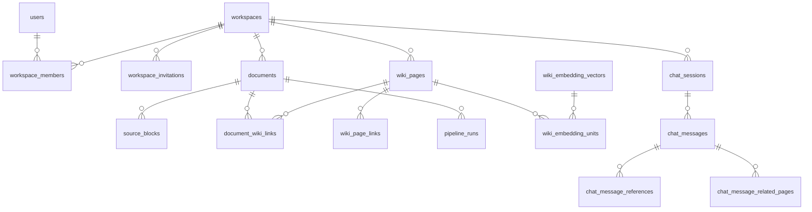

# 데이터 모델 요약

MSA 전환 후 데이터 소유·저장소 구조 압축본.
상세 원문: `docs/backlog/Fruition_MVP_Erd.md`, `docs/backlog/spec/pipeline-db-ownership.md`, `docs/backlog/msa/current-architecture.md` §4.

## 1. 저장소 개요

| 저장소 | 소유 서비스 | 용도 |
|---|---|---|
| **access_db** (PostgreSQL) | access-svc | 사용자·OAuth·refresh token·워크스페이스·멤버 (자체 Flyway) |
| **core_db** (PostgreSQL) | document-svc | 문서 metadata·폴더·채팅·operation·본문·편집 revision·write receipt·content version·asset/reference·Agent 적용 projection·감사·편집 outbox |
| **ai_db** (PostgreSQL) | ai-svc | Wiki 현재 상태·pipeline run·embedding·schema·문서 파생물 stale 추적·Agent·Skill·checkpoint (`ai_schema.sql`) |
| **Redis** | access-svc / document-svc / ai-svc | 권한 projection·OAuth 교환 코드 / query run·SSE / user+workspace Concept index (write lock은 ai_db advisory lock) |
| **S3/MinIO** | document-svc | 문서 원본·snapshot, Wiki markdown 본문 |

**object key 표기 규약**: `documents.source_uri`는 항상 평문 키(`sources/documents/{document_id}/original`)다. document-svc가 문서를 만들 때 조립해 넣고 이후 바뀌지 않으며, `s3://` 형식은 `Document` 생성자가 거부한다. `s3://<bucket>/<key>` 형식이 들어오는 컬럼은 파이프라인이 콜백으로 채우는 `documents.extracted_text_uri` 뿐이다. 두 표기가 섞이면 쓰기와 읽기가 서로 다른 키를 가리켜도 오류 없이 어긋나므로, 읽기·쓰기 양쪽 모두 `normalizeObjectKey`를 거친다.

## 2. DB별 핵심 테이블

서비스가 자기 테이블과 migration 문서를 소유한다.

- [Access의 access_db](https://github.com/FruitionKR/Fruition-access/blob/main/docs/data-model.md)
- [Document의 core_db](https://github.com/FruitionKR/Fruition-document/blob/main/docs/data-model.md)
- [AI의 ai_db](https://github.com/FruitionKR/Fruition-ai/blob/main/docs/data-model.md)

## 3. 핵심 관계

주의: DB 경계를 넘는 ID 관계는 V27부터 물리 FK가 아닌 논리 참조다. document-svc는 Wiki 현재 상태를 AI 내부 API로 읽는다.

## 4. 계정 격리 정책

- DB 계정은 **runtime(DML) / migration(DDL) 분리**: `access_runtime/migration`, `core_runtime/migration`, `ai_runtime/migration` (`infra/postgres/init-db-isolation.sh`).
- AWS runtime은 자기 runtime 자격증명만 받고 migration 자격증명은 별도 Job만 받는다. bootstrap 관리자 인증은 runtime/Job에 주입하지 않는다. 로컬 startup migration은 자기 서비스 migration 계정만 사용하는 개발 실행 예외다.
- 타 서비스 DB write를 금지한다. `ai_runtime`에는 core DB DML 권한과 runtime 연결 설정을 부여하지 않는다.
- 코드 경계도 컴파일러가 강제: access-svc와 document-svc는 서로의 repository를 import하지 않고 내부 API·Redis projection으로만 연결.
- Idempotency 테이블은 각 DB에 서비스별 사본(공통 코드는 각 서비스 내부 소유, 테이블 분리)을 둔다. `(user_id, endpoint_scope, idempotency_key)` unique constraint로 실행 전 `IN_PROGRESS`를 원자 선점하고, 비즈니스 변경과 응답 저장이 같이 commit되면 `COMPLETED`로 전환한다. `IN_PROGRESS.expires_at`은 15분 실행 lease이며 만료 재선점은 같은 `request_hash`에만 허용하고 `claim_token`을 교체해 이전 실행을 fencing한다. 문서 resource ID·MinIO object key는 각 `claim_token`별로 다르게 만들어 이전 실행의 rollback cleanup이 재선점 실행의 객체를 삭제하지 못하게 한다. 신규 `COMPLETED` 기록은 응답과 완료 시점+24시간 `expires_at`을 저장한다. 기존 행은 migration에서 `COMPLETED`로 간주한다.

## 5. AI 저장소 cutover 안정화

- Wiki·Agent·Skill·checkpoint는 ID를 보존해 ai_db로 이전한다. core의 기존 source 테이블은 rollback 안정화 기간 동안 read-only로 보존하고 별도 migration에서 제거한다.
- Agent/Skill/checkpoint DDL의 단일 소유자는 Python `ai_schema.sql`이다. 팀 멤버십은 `workspace_members`를 직접 join하지 않고 access-svc 내부 권한 API로 조회한다.
- Markdown Agent는 ai_db의 `agent_runs`·`agent_jobs`로 실행·취소하고, core_db의 `ai_task_runs`가 채팅·업무 변경까지 복구를 조율한다. 비 Agent 작업은 ai_db의 `ai_task_runs`·`ai_task_changes`를 사용한다. Agent Tool 실행의 역작업은 `agent_tool_executions`에 별도 멱등키로 기록하며, 적용 projection의 `autonomous_tool`은 일반 턴 적용과 도구 역작업의 인가 경계를 구분한다.

취소로 본문을 복구한 뒤에도 `document_edit_states.revision`은 증가한다. 복구 outbox 이벤트를 AI 파생 상태에 동기 반영해 늦은 기존 편집 이벤트가 복구를 뒤집지 못하게 한다. 생성 문서 삭제의 파생 상태 tombstone과 작업·멱등 기록은 운영 기록으로 유지한다.

AI 실행 진단 로그는 S3 `pipeline-runs/{run_id}/pipeline.log`에 저장한다. 상태·manifest의 소유권은 ai_db에 있으며, 진단 로그는 업무 object 취소 rollback 대상이 아니다. 실행 재시도는 같은 key에 새 시도 로그를 저장한다.

AWS Redis는 서비스별 ACL 사용자로 분리한다. Access의 `auth:*`·`oauth:exchange:*`, Document의 `query:*`, AI의 `wiki:concept-index:*` 값 접근을 분리하고 `authz:role:*`는 Access 삭제/Document 적재·조회인 명시적 공유 projection이다. Access SCAN의 key 이름 열람 예외가 있다. S3 Document·AI prefix별 값 접근과 앱 bucket ListBucket metadata 예외는 [아키텍처](architecture.md#aws-저장소통신-권한)를 따른다.
